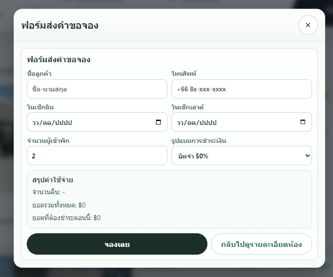

# Resort Multi-tenant Website Template (Next.js 16)

UI website template for multi-tenant resorts with a BFF layer for backend and central-platform integration.

## Stack
- Next.js 16 (App Router)
- TypeScript
- Vercel deployment ready


## Environment Mode (Dev vs Production)
- Local development (`.env.local`):
  - `NEXT_PUBLIC_TEMPLATE_BOOKING_MOCK=true`
  - Booking flow uses tenant-safe mock availability for smoother template demo.
- Production (Vercel):
  - Set `NEXT_PUBLIC_TEMPLATE_BOOKING_MOCK=false`
  - Booking flow uses live availability check via BFF (`/api/site/[tenantSlug]/rooms`).

## Vercel Template Showcase (Per Resort Owner)
- Recommended while waiting backend/central activation:
  - Keep website in template/demo mode per tenant (owner-isolated).
  - Use same app with tenant routes: `/site/{tenantSlug}`.
  - Publish on Vercel domain, for example:
    - `sst-innovation.vercel.app/site/forest-escape`
    - `sst-innovation.vercel.app/site/lake-serenity`
- When central platform opens package + IDs:
  - Keep tenant identity unchanged (`tenantSlug`, `ownerId`, `resortId`).
  - Switch content source from template/mock to live backend/central data.
  - No cross-tenant data mixing allowed.
## Latest Update: Booking Form Guardrails (Rooms Popup)
- What changed:
  - Added strict phone validation:
    - digits only
    - exactly 10 digits
    - expected local format `0XXXXXXXXX`
  - Updated phone placeholder to `08x-xxx-xxx`.
  - Improved payment summary readability with clearer highlighted amounts.
  - Locked guest count input to room package/capacity data (read-only).
  - Added date constraints:
    - check-in/check-out cannot be in the past
    - check-out must be after check-in
  - Added tenant-safe availability re-check on date selection and before submit:
    - `GET /api/site/[tenantSlug]/rooms?checkIn=YYYY-MM-DD&nights=1..30`
    - if sold out, warning is shown under date section and booking button is disabled.
- Files/routes affected:
  - `src/components/room-detail-modal.tsx`
  - `src/app/globals.css`
  - `messages/en.json`
  - `messages/th.json`
  - `/site/[tenantSlug]/rooms`
  - `GET /api/site/[tenantSlug]/rooms`
  - `POST /api/site/[tenantSlug]/leads`
- Tenant isolation notes:
  - Availability checks and lead submission remain scoped by current tenant route/context.
  - No cross-tenant data merge behavior introduced.
- Fallback notes:
  - Backend/central/static fallback order is unchanged:
    1. owner backend
    2. central platform
    3. local static fallback
  - Template booking mode for development:
    - default: mock availability enabled (no blocking wait on backend availability check)
    - set `NEXT_PUBLIC_TEMPLATE_BOOKING_MOCK=false` to force live availability check from BFF.

## Latest Update: Rooms Booking Submit Feedback Popup (Tenant-safe)
- What changed:
  - Added booking submit feedback popup states in Room Detail booking form:
    - `loading`: shows modern centered spinner popup while sending booking request.
    - `success`: shows customer-friendly success message and booking reference when returned.
    - `error`: shows retry/close actions with safe error detail handling.
  - Preserved two-step modal flow:
    - Step 1: room details
    - Step 2: booking form (opened via `จองเลย / Select`)
  - Fixed modal close icon rendering (`×`) for consistent UX.
- Files/routes affected:
  - `src/components/room-detail-modal.tsx`
  - `src/app/globals.css`
  - `messages/th.json`
  - `messages/en.json`
  - Route behavior:
    - `/site/[tenantSlug]/rooms`
    - `POST /api/site/[tenantSlug]/leads`
- Content keys affected (ResortHome):
  - `roomBookingSendingTitle`
  - `roomBookingSendingDescription`
  - `roomBookingSuccessTitle`
  - `roomBookingSuccessDescription`
  - `roomBookingReferenceLabel`
  - `roomBookingErrorTitle`
  - `roomBookingErrorDescription`
  - `roomBookingRetry`
  - `roomBookingClosePopup`
- Tenant isolation notes:
  - Booking submission remains tenant-scoped by route `tenantSlug`.
  - Payload still carries room + stay context for backend-side owner/resort verification.
  - No cross-tenant data read/write behavior introduced in UI flow.
- Backend/central/static fallback notes:
  - No change to fallback chain:
    1. owner backend
    2. central platform
    3. local static fallback
  - If API returns success with reference ID, popup displays it directly.
  - If API/connection fails, popup shows safe retry flow without breaking existing room data rendering.
- i18n notes:
  - Thai/English booking feedback labels are fully keyed (no hardcoded broken text).
  - Default locale remains `th-TH` and locale persistence remains unchanged.
- Booking handoff notes:
  - Backend/central can optionally return `referenceId` in lead response for customer-facing tracking.
  - UI success popup will render booking reference automatically when present.

## Latest Update: Backend/Central Schema for `ui.booking`
- What changed:
  - Added strict runtime sanitizer for `home.ui.booking` payloads before UI usage.
  - Added formal JSON Schema for backend/central teams.
  - Added handoff document with real tenant payload examples.
- Files/routes affected:
  - `src/lib/content/site-ui.ts` (new)
  - `src/lib/dto/normalize.ts`
  - `docs/schemas/ui.booking.schema.json` (new)
  - `docs/UI-BOOKING-SCHEMA.md` (new)
  - No route contract changes.
- Content keys affected:
  - No i18n key changes.
  - Payload path standardized: `home.ui.booking`.
- Tenant isolation notes:
  - Schema/payload is per-tenant only and must stay scoped by:
    - `tenantSlug`
    - `ownerId`
    - `resortId`
  - No cross-tenant policy sharing.
- Backend/central/static fallback notes:
  - Fallback chain unchanged:
    1. owner backend
    2. central platform
    3. local static fallback
  - New sanitizer hardens invalid `ui.booking` inputs without breaking fallback.
- Handoff notes:
  - Backend/central should follow:
    - `docs/schemas/ui.booking.schema.json`
    - `docs/UI-BOOKING-SCHEMA.md`
  - Real tenant examples included for:
    - `forest-escape`
    - `lake-serenity`
    - `demo-resort`

## Latest Update: Rooms Booking Package Control (Per Tenant)
- What changed:
  - Added package-driven booking behavior for `Rooms > Room Detail Modal`:
    - `contact_only`: `จองเลย / Book now` routes user to tenant contact flow.
    - `booking_enabled`: `จองเลย / Book now` opens in-modal booking request form.
  - Added booking form flow in room modal:
    - Inputs: customer name, phone, check-in, check-out, guests, payment option.
    - Auto calculation: nights, total amount (`nights * room price`), payable now.
    - Payment option support: `deposit_50` and `full` (tenant/package configurable).
  - Booking submit still uses existing tenant-safe BFF lead endpoint:
    - `POST /api/site/{tenantSlug}/leads`
    - Includes room/date/payment summary in `message` metadata for backend handoff.
- Files/routes affected:
  - Route behavior:
    - `/site/[tenantSlug]/rooms`
    - `POST /api/site/[tenantSlug]/leads`
  - Updated files:
    - `src/components/room-detail-modal.tsx`
    - `src/components/room-availability-list.tsx`
    - `src/components/resort-rooms-page.tsx`
    - `src/components/room-mobile-card.tsx`
    - `src/lib/types/site.ts`
    - `src/lib/tenants/static-content.ts`
    - `src/app/globals.css`
    - `messages/th.json`
    - `messages/en.json`
- Content keys affected:
  - Added (ResortHome):
    - `roomBookNowAction`
    - `roomBookingContactAction`
    - `roomBookingFormTitle`
    - `roomBookingPaymentOption`
    - `roomBookingDepositOptionLabel`
    - `roomBookingFullOptionLabel`
    - `roomBookingSummaryTitle`
    - `roomBookingTotalAmount`
    - `roomBookingPayableAmount`
    - `roomBookingSubmitting`
    - `roomBookingSubmitFailed`
    - `roomBookingBackToDetails`
  - Updated:
    - `roomSendBookingRequest`
- Tenant isolation notes:
  - Tenant context remains route-scoped by `tenantSlug`.
  - Lead submission remains tenant-scoped via `/api/site/{tenantSlug}/leads`.
  - Upstream separation remains by `tenantSlug`, `ownerId`, `resortId` and forwarded tenant headers in BFF.
- Backend/central/static fallback notes:
  - No change to fallback order:
    1. Owner backend
    2. Central platform
    3. Local static fallback
  - Package config is consumed from `home.ui.booking` (backend/central when available, static fallback otherwise).
- i18n notes:
  - Preserved `th-TH` and `en-US` flows.
  - Added Thai/English keys for booking package mode and booking form summary.
- Search/result state behavior:
  - Existing rooms search behavior is unchanged.
  - Booking mode affects only room action handling after room selection.
- Error/fallback behavior:
  - If booking form submit fails, user gets inline modal error and can retry.
  - `contact_only` mode avoids booking form and safely routes to contact flow.
- Handoff notes for backend/central platform:
  - Central platform should provide per-tenant package policy in `ui.booking`:
    - `mode`: `contact_only | booking_enabled`
    - `allowBookingForm`: boolean
    - `paymentOptions`: `["deposit_50","full"]` or `["full"]`
    - `defaultPaymentOption`
    - `depositPercent`
    - `contactRoute`
  - Backend/admin should continue scoping booking/lead processing by:
    - `tenantSlug`
    - `ownerId`
    - `resortId`

## Dev Server (Windows Stable)
- Default command (recommended):
  - `npm run dev`
- This now runs `scripts/dev-reset.ps1` with `-NoProfile -ExecutionPolicy Bypass` to prevent common Windows issues:
  - stale lock / port 3000 still in use
  - `node` not found from PATH in child process
- Automatic fallback ports are enabled:
  - default order: `3000 -> 3001 -> 3002`
  - if `3000` is busy, dev server auto-starts on next free fallback port
- Optional overrides:
  - `npm run dev -- -Port 3010` to set preferred port
  - `npm run dev -- -FallbackPorts 3011,3012` to set fallback list
  - `npm run dev -- -ForcePreferredPort` to force-kill process on preferred port and reuse it
- Extra commands:
  - `npm run dev:stop` to stop current dev server on port 3000
  - `npm run dev:stop -- -Port 3001` to stop server on another port
  - `npm run dev:raw` to run the original `next dev --webpack` directly

## Tenant Isolation (Non-Negotiable)
Every UI/content/integration update must preserve tenant separation.

Each resort owner/site is isolated by:
- `tenantSlug` (public routing identity)
- `ownerId` (owner identity)
- `resortId` (resort identity)

Never mix content or data across resort owners.

## Content Source Priority (Always)
For website content, the fallback priority is:
1. Owner/tenant backend content
2. Central platform fallback content
3. Local static fallback content

This includes Home, Hero/Navbar-related content, and all extended homepage sections.

## Home Hero + Navbar Failover (Do Not Break)
- Primary source: `BACKEND_API_BASE_URL /site/home`
- Fallback source: `CENTRAL_API_BASE_URL /site/home`
- Last-resort fallback: local static tenant content

Editable home payload fields may come from backend/central, with static as final safety fallback.

## BFF Headers (Must Be Preserved)
When BFF forwards requests to backend/central systems, it sends:
- `x-tenant-slug`
- `x-tenant-id` (mapped from `resortId`)
- `x-resort-id`
- `x-owner-id`
- `x-internal-secret` (if configured)

## BFF API Contracts (Do Not Break)
- `GET /api/site/home`
- `GET /api/site/rooms?checkIn=YYYY-MM-DD&nights=1..30`
- `POST /api/site/leads`

## Central Platform Responsibility
The central platform is responsible for:
- Approving/creating rental system accounts
- Opening tenant IDs or rental packages
- Managing central fallback content
- Coordinating with backend/admin systems

## Integration Safety Rules
- Do not weaken `backend -> central -> static` fallback behavior.
- Do not weaken tenant isolation by `tenantSlug`, `ownerId`, `resortId`.
- Do not introduce shared global tenant content, except explicit central fallback content.
- Do not change tenant registry semantics unless explicitly planned and documented.

## Delivery Rule for Every Completed UI/System Update
Before handoff to:
- Backend/admin system team
- Central platform team

Always update this `README.md` with:
- What was changed
- What contracts/fallback logic were preserved
- Any new content keys/fields and where they load from

## Formal Handoff Notice (Template Data + Owner ID Separation)
During the current handoff phase, all content shown in UI pages may be mock/template content for layout and behavior demonstration only.

This means:
- UI text/images/cards shown now are not always production business data.
- Production data authority will come from:
  1. Owner backend/admin system
  2. Central platform fallback
  3. Local static fallback (safety only)

Strict owner separation is mandatory for every request and payload:
- Separate each resort owner by `ownerId`.
- Separate each resort/site by `resortId`.
- Keep route-level identity by `tenantSlug`.
- Never mix content, availability results, leads, or admin edits across different `ownerId` / `resortId`.

Handoff requirement for backend/admin and central teams:
- Treat current UI content as template-safe defaults until live content integration is completed.
- Ensure write/read operations are scoped to the active tenant identity:
  - `tenantSlug`
  - `ownerId`
  - `resortId`
- Preserve BFF header forwarding and fallback chain exactly as documented in this README.

## Formal Payload Contract Examples (Home / Rooms / Leads)
These examples are reference contracts for backend/admin and central-platform integration during handoff.

Important:
- Public BFF endpoint contracts below remain unchanged.
- Tenant identity (`tenantSlug`, `ownerId`, `resortId`) must always be present in tenant context and request headers when BFF calls upstream systems.
- Do not return or consume cross-tenant data.

### 1) Home Contract (`GET /api/site/home`)
Public BFF contract:
- Method: `GET`
- Path: `/api/site/home` or `/api/site/{tenantSlug}/home`
- Query: none

Expected BFF upstream identity headers:
```http
x-tenant-slug: forest-escape
x-tenant-id: resort_001
x-resort-id: resort_001
x-owner-id: owner_001
x-internal-secret: <optional>
```

Reference response shape (simplified):
```json
{
  "tenant": {
    "tenantSlug": "forest-escape",
    "brand": "Forest Escape Resort",
    "locale": "th"
  },
  "hero": {
    "title": "Welcome",
    "subtitle": "Template content during handoff",
    "ctaLabel": "Book now",
    "heroImageUrl": "/images/hero.jpg"
  },
  "roomsFeaturedGallery": [],
  "homepageAmenities": {},
  "homepageHotelInfo": {},
  "contact": {
    "phone": "+66 89 000 1111",
    "email": "booking@example.com"
  },
  "footer": {}
}
```

Tenant-safety notes:
- Response must belong to exactly one tenant context.
- No field should be merged from another `ownerId` / `resortId`.

### 2) Rooms Contract (`GET /api/site/rooms?checkIn=YYYY-MM-DD&nights=1..30`)
Public BFF contract:
- Method: `GET`
- Path: `/api/site/rooms` or `/api/site/{tenantSlug}/rooms`
- Query:
  - `checkIn`: `YYYY-MM-DD`
  - `nights`: integer `1..30`

Validation rules:
- `checkIn` must match ISO date format `YYYY-MM-DD`.
- `nights` must be an integer and inside `1..30`.
- Invalid query must not trigger cross-tenant fallback leakage.

Reference response shape (current compatible):
```json
[
  {
    "id": "room-deluxe-king",
    "name": "Deluxe King",
    "description": "Template room description",
    "nightlyPriceTHB": 3200,
    "imageUrl": "/images/rooms/deluxe-king.jpg",
    "badge": "Best seller"
  }
]
```

Reference extended response shape (optional upstream model):
```json
{
  "checkIn": "2026-05-10",
  "nights": 2,
  "currency": "THB",
  "totalAvailable": 2,
  "availableRooms": [],
  "unavailableRooms": []
}
```

Tenant-safety notes:
- Availability must be scoped to the current `tenantSlug` + `ownerId` + `resortId`.
- Never mix room inventory across owners.

### 3) Leads Contract (`POST /api/site/leads`)
Public BFF contract:
- Method: `POST`
- Path: `/api/site/leads` or `/api/site/{tenantSlug}/leads`
- Body (JSON):
```json
{
  "customerName": "John Doe",
  "phone": "+66 89 000 1111",
  "email": "john@example.com",
  "checkIn": "2026-05-10",
  "checkOut": "2026-05-12",
  "roomId": "room-deluxe-king",
  "message": "Need airport pickup"
}
```

Validation rules:
- `customerName` required.
- If provided, `email` must be valid format.
- If provided, `checkIn` / `checkOut` must be `YYYY-MM-DD`.
- If both dates exist, `checkOut` must be after `checkIn`.

Reference success response:
```json
{
  "ok": true,
  "referenceId": "LEAD-20260507-0001"
}
```

Tenant-safety notes:
- Lead submission must be written only under the active tenant identity.
- No lead from tenant A can be stored under tenant B (`ownerId` / `resortId` mismatch forbidden).

### Cross-System Tenant-Safety Checklist
- Always resolve tenant context before data read/write:
  - `tenantSlug`
  - `ownerId`
  - `resortId`
- Always forward BFF identity headers to backend/central systems.
- Keep fallback order unchanged:
  1. owner backend
  2. central platform fallback
  3. local static fallback
- Treat current UI data as template-safe defaults until full backend/central integration is complete.

## Latest Update (Rooms Section Migration)
- Homepage cleanup:
  - Removed the homepage Rooms intro/cards rendering from `src/components/resort-home.tsx`.
  - Hero, Navbar/Header, Booking/Search card, and Footer design were left intact.
- New/updated routes:
  - Added `GET page /rooms` route handler at `src/app/rooms/page.tsx` (tenant-aware redirect to `/site/{tenantSlug}/rooms`).
  - Added dedicated tenant rooms page `src/app/site/[tenantSlug]/rooms/page.tsx`.
  - Navbar menu route remains `ห้องพัก -> /rooms` in `src/components/top-navbar.tsx`.
- Content/API source used:
  - Rooms page loads room data via existing adapter flow `getContentAdapter().getRooms(tenantSlug, criteria)`.
  - Home page continues loading home payload via existing adapter flow `getContentAdapter().getSiteHome(tenantSlug)`.
  - Existing BFF endpoint contracts remain unchanged:
    - `GET /api/site/home`
    - `GET /api/site/rooms?checkIn=YYYY-MM-DD&nights=1..30`
    - `POST /api/site/leads`
- Tenant isolation notes:
  - Tenant context continues to resolve by existing identifiers and resolver flow:
    - `tenantSlug`, `ownerId`, `resortId`
  - No tenant registry schema changes.
  - No cross-tenant data mixing introduced.
- Fallback behavior notes:
  - Existing architecture and fallback design were preserved.
  - No changes to BFF forwarding headers:
    - `x-tenant-slug`, `x-tenant-id`, `x-resort-id`, `x-owner-id`, `x-internal-secret` (if configured)
  - No backend/central/static failover contract rewrites.
- Handoff notes:
  - Backend/admin team: no new API contract required for this change; existing room/home APIs remain the source.
  - Central platform team: no change to tenant provisioning flow; routing now includes tenant-specific Rooms page render path.

## Latest Update (Home Rooms Intro Static Lock)
- Added Rooms intro block back under Hero on homepage at `src/components/resort-home.tsx`.
- This specific intro block is now local static content in frontend code and is intentionally not sourced from backend/admin or central platform content.
- Multi-tenant routing, BFF headers, and fallback flow for other sections remain unchanged.

## Latest Update (Rooms Featured Gallery Section)
- Added a new visual featured room gallery section directly below Rooms intro on the Rooms page:
  - UI component: `src/components/resort-rooms-page.tsx`
  - Styles: `src/app/globals.css` (`.rooms-featured-*` selectors)
- New content key for admin/backend and central fallback:
  - `rooms.featuredGallery`
- New data shape (tenant-scoped):
  - `featuredGallery[]` item fields:
    - `id: string`
    - `title: string`
    - `sizeText: string`
    - `imageUrl: string`
    - `altText?: string`
    - `order?: number`
    - `isVisible?: boolean`
- Content model integration:
  - `SiteHomeDTO` extended with `roomsFeaturedGallery?: FeaturedGalleryItemDTO[]`
  - Sanitizer: `src/lib/content/rooms-featured-gallery.ts`
  - Home DTO normalization includes featured gallery sanitization.
- Fallback notes (preserved architecture):
  - Tenant backend source: `BACKEND_API_BASE_URL /site/home`
  - Central fallback source: `CENTRAL_API_BASE_URL /site/home`
  - Local static fallback source: `getStaticHomeByTenant(tenantSlug)` in `src/lib/tenants/static-content.ts`
  - In API mode, backend home payload will merge missing/invalid `roomsFeaturedGallery` from central when available.
- Tenant isolation notes:
  - Tenant context and data isolation remain based on `tenantSlug`, `ownerId`, and `resortId`.
  - BFF forwarding headers remain unchanged:
    - `x-tenant-slug`, `x-tenant-id`, `x-resort-id`, `x-owner-id`, `x-internal-secret` (if configured)
  - No tenant registry structure changes and no cross-tenant content mixing.
- Handoff notes:
  - Backend/admin team: can provide editable per-tenant `roomsFeaturedGallery` in `/site/home` payload.
  - Central platform team: can provide fallback `roomsFeaturedGallery` using the same key and shape for failover.

## Latest Update (Rooms Featured Gallery Rendering Fix)
- Fixed blank area below Rooms intro on Rooms page by making gallery rendering fail-safe in:
  - `src/components/resort-rooms-page.tsx`
- Root cause:
  - gallery items were filtered by `isVisible`, and when all incoming items were hidden, section did not render.
- Fix behavior:
  - Rooms featured gallery section now always renders on Rooms page.
  - If visible items from tenant/backend/central are empty, UI falls back to local static featured gallery items.
  - Fallback item IDs and labels now align with expected defaults:
    - `deluxe-king`
    - `deluxe-twin`
    - `deluxe-triple`
- Fallback chain remains unchanged:
  - tenant backend -> central platform -> local static fallback
- Tenant isolation unchanged:
  - `tenantSlug`, `ownerId`, `resortId` remain the isolation boundary
  - no cross-tenant data sharing introduced
- Handoff notes:
  - Backend/admin team: continue sending tenant-scoped `roomsFeaturedGallery`; optional `isVisible` is supported.
  - Central platform team: keep fallback payload tenant-safe; local static fallback is the final safety layer.

## Latest Update (Featured Gallery Moved To Homepage)
- Moved Featured Room Gallery image strip placement from Rooms page to homepage.
  - Added reusable component: `src/components/featured-room-gallery.tsx`
  - Homepage render: `src/components/resort-home.tsx` (below Rooms intro area)
  - Removed gallery strip render from `src/components/resort-rooms-page.tsx` to avoid duplication.
- Content key used:
  - `rooms.featuredGallery`
- Tenant isolation notes:
  - Tenant content remains resolved per request context (`tenantSlug`, `ownerId`, `resortId`)
  - No tenant registry structure changes
  - No cross-tenant gallery rendering introduced
- Backend/central/static fallback notes:
  - Fallback chain preserved: tenant backend -> central platform -> local static fallback
  - In API mode, if backend/central home payload lacks valid `roomsFeaturedGallery`, BFF now supplements from tenant static fallback.
- Handoff notes:
  - Backend/admin team: manage `rooms.featuredGallery` per tenant in home payload.
  - Central platform team: provide tenant-safe fallback values for `rooms.featuredGallery`; static remains final safety layer.

## Latest Update (Rooms Empty-State Copy Polish)
- Improved Rooms page empty-state messaging for clearer user guidance when no room results are available.
  - Updated localization key value: `ResortHome.roomsEmpty`
  - Updated locale files:
    - `messages/en.json`
    - `messages/th.json`
    - `messages/ja.json`
    - `messages/ko.json`
    - `messages/ru.json`
    - `messages/zh.json`
- Route and API contract notes:
  - No route changes.
  - No API contract changes:
    - `GET /api/site/home`
    - `GET /api/site/rooms?checkIn=YYYY-MM-DD&nights=1..30`
    - `POST /api/site/leads`
- Content key notes:
  - `rooms.featuredGallery` remains unchanged and still renders only on homepage.
  - Rooms page continues rendering full room listing/grid without duplicating featured gallery.
- Tenant isolation notes:
  - No changes to tenant isolation boundaries:
    - `tenantSlug`
    - `ownerId`
    - `resortId`
  - No cross-tenant content/data mixing introduced.
- Fallback behavior notes:
  - Preserved fallback chain: backend -> central -> static.
  - No changes to BFF forwarding headers:
    - `x-tenant-slug`
    - `x-tenant-id`
    - `x-resort-id`
    - `x-owner-id`
    - `x-internal-secret` (if configured)
- Handoff notes:
  - Backend/admin team: no payload/schema change required for this update.
  - Central platform team: no fallback model change required for this update.

## Latest Update (Active Nav + Clickable Logo Home Link)
- Added `Active Navigation State` in Navbar/Header so the current page link is visually highlighted.
  - Implemented in: `src/components/top-navbar.tsx`
  - Active-route detection uses current pathname and maps tenant paths safely:
    - `/` and `/site/{tenantSlug}` -> หน้าแรก (`/`)
    - `/rooms` and `/site/{tenantSlug}/rooms` -> ห้องพัก (`/rooms`)
    - `/activities` and `/site/{tenantSlug}/activities` -> กิจกรรม (`/activities`)
    - `/about` and `/site/{tenantSlug}/about` -> เกี่ยวกับเรา (`/about`)
    - `/contact` and `/site/{tenantSlug}/contact` -> ติดต่อเรา (`/contact`)
- Added `Clickable Logo Home Link` (Logo Home Navigation).
  - Wrapped desktop and mobile logo areas with `Link` to `/`
  - Added accessibility label: `aria-label="Go to homepage"`
  - Preserved existing logo visual design and navbar layout.
- Minimal style updates for active nav state:
  - Updated in: `src/app/globals.css`
  - Active link keeps subtle premium styling with accent underline and readable text in both dark and light navbar interaction states.
- Routes affected:
  - `/`
  - `/rooms`
  - `/activities`
  - `/about`
  - `/contact`
- Backend/BFF/tenant behavior notes:
  - No backend API changes.
  - No BFF contract changes:
    - `GET /api/site/home`
    - `GET /api/site/rooms?checkIn=YYYY-MM-DD&nights=1..30`
    - `POST /api/site/leads`
  - No tenant isolation changes (`tenantSlug`, `ownerId`, `resortId`).
  - No changes to fallback order (`backend -> central -> static`) or forwarding headers (`x-tenant-slug`, `x-tenant-id`, `x-resort-id`, `x-owner-id`, `x-internal-secret` if configured).
- Handoff notes:
  - Backend/admin team: no payload/schema update required; this is a frontend navigation behavior improvement only.
  - Central platform team: no fallback content/data model change required; tenant-safe behavior remains unchanged.

## Latest Update (Homepage Services/Amenities Editable Model)
- Added a new Services/Amenities section above Footer on homepage render:
  - Render location: `src/components/resort-home.tsx`
  - New component: `src/components/homepage-amenities.tsx`
  - New styles: `src/app/globals.css` (`.amenities-*` selectors)
- Services/Amenities now supports up to 6 editable items, sorted by `order`, and renders only visible items.
- New content key:
  - `homepage.amenities`
- New structured data shape:
  - `homepageAmenities: {`
  - `  eyebrow: string`
  - `  heading: string`
  - `  isVisible?: boolean`
  - `  items: Array<{`
  - `    id: string`
  - `    iconKey: string`
  - `    title: string`
  - `    description: string`
  - `    order: number`
  - `    isVisible: boolean`
  - `  }>`
  - `}`
- Editable backend/admin fields (tenant-scoped):
  - add item
  - edit item
  - delete item
  - change `iconKey`
  - change `title`
  - change `description`
  - change `order`
  - enable/disable `isVisible`
- IconKey system:
  - Implemented iconKey-based internal SVG map (no new icon library):
    - `security-camera`
    - `laundry`
    - `shuttle`
    - `wifi`
    - `breakfast`
    - `support`
  - Unknown `iconKey` now renders a safe fallback icon.
- Add/edit/delete/reorder/visibility behavior:
  - Section sanitization supports structured item editing and stable IDs.
  - Items are sorted by `order`.
  - Only items with `isVisible !== false` are rendered.
  - Frontend enforces a max render count of 6 items.
- Tenant isolation notes:
  - No change to tenant isolation boundaries:
    - `tenantSlug`
    - `ownerId`
    - `resortId`
  - No cross-tenant content mixing introduced.
  - Amenities content remains resolved in current tenant request context only.
- Backend/central/static fallback notes:
  - Preserved fallback chain: tenant backend -> central platform -> local static fallback.
  - In API mode, backend home payload amenities fallback behavior:
    - invalid/missing backend amenities -> central amenities (if valid)
    - invalid/missing central amenities -> tenant static amenities fallback
  - Static fallback now includes 6 default amenities items.
  - No BFF header changes:
    - `x-tenant-slug`
    - `x-tenant-id`
    - `x-resort-id`
    - `x-owner-id`
    - `x-internal-secret` (if configured)
- Handoff notes:
  - Backend/admin team:
    - Persist `homepage.amenities` per tenant owner context.
    - Keep item `id` stable for edit/delete/reorder operations.
    - Do not share amenities payload across tenants.
  - Central platform team:
    - Provide tenant-safe fallback `homepage.amenities` with same shape.
    - Keep central fallback separate from tenant-owned backend content.

## Latest Update (Homepage Hotel Information Section)
- Added a new compact Hotel Information section on homepage.
  - Render location: `src/components/resort-home.tsx`
  - New component: `src/components/homepage-hotel-info.tsx`
  - Placement: above Footer, after existing homepage content sections (including amenities when present)
  - Not placed in Hero, Booking/Search card, Rooms page, or Footer body.
- New content key:
  - `homepage.hotelInfo`
- New structured data shape:
  - `homepageHotelInfo: {`
  - `  heading: string`
  - `  isVisible?: boolean`
  - `  items: Array<{`
  - `    id: string`
  - `    iconKey: string`
  - `    title: string`
  - `    description?: string`
  - `    order: number`
  - `    isVisible: boolean`
  - `  }>`
  - `}`
- Editable backend/admin fields (tenant-scoped):
  - add item
  - edit item
  - delete item
  - change `iconKey`
  - change `title`
  - change `description`
  - change `order`
  - enable/disable `isVisible`
- IconKey system:
  - Implemented iconKey-based internal SVG map (no new icon library):
    - `clock`
    - `check`
    - `bell`
    - `pet`
    - `parking`
    - `info`
  - Unknown `iconKey` uses safe fallback icon (`info`).
- Add/edit/delete/reorder/visibility behavior:
  - Frontend renders only visible items (`isVisible !== false`)
  - Frontend sorts by `order`
  - Section supports at least 6 editable items and is not locked to static text.
- Tenant isolation notes:
  - No change to tenant isolation boundaries:
    - `tenantSlug`
    - `ownerId`
    - `resortId`
  - No cross-tenant hotel information sharing introduced.
- Backend/central/static fallback notes:
  - Preserved fallback chain: tenant backend -> central platform -> local static fallback.
  - In API mode, hotel info in home payload follows same merge pattern:
    - invalid/missing tenant backend hotel info -> central fallback hotel info
    - invalid/missing central hotel info -> tenant static fallback hotel info
  - BFF headers preserved:
    - `x-tenant-slug`
    - `x-tenant-id`
    - `x-resort-id`
    - `x-owner-id`
    - `x-internal-secret` (if configured)
- Handoff notes:
  - Backend/admin team:
    - Manage `homepage.hotelInfo` per tenant owner context.
    - Keep item IDs stable for safe edit/delete/reorder workflows.
    - Ensure updates are tenant-scoped only.
  - Central platform team:
    - Provide fallback `homepage.hotelInfo` with same structure.
    - Keep central fallback content separate from tenant-owned content.

## Latest Update (Contact/Booking Section Moved To Contact Page)
- Moved the homepage Contact / Booking Request section to a dedicated Contact page.
  - Homepage source updated: `src/components/resort-home.tsx` (contact block removed)
  - New page component: `src/components/resort-contact-page.tsx`
  - New tenant contact route: `src/app/site/[tenantSlug]/contact/page.tsx`
  - New index route redirect: `src/app/contact/page.tsx` -> `/site/{tenantSlug}/contact`
- Contact route:
  - Navbar menu `ติดต่อเรา` continues using `/contact` and now resolves to tenant contact page via redirect.
- Contact content key/data shape used:
  - Reused existing home payload structures from `GET /api/site/home`:
    - `contact` (phone, email, lineId)
    - `footer.contact` (address, supportHours, phone, email)
  - Contact page reads tenant-scoped contact information from these existing structures; no separate API contract added.
- Lead submission/API notes:
  - Form submission behavior preserved.
  - Still uses `POST /api/site/leads` via existing `LeadForm` flow.
  - Tenant-specific lead endpoint pattern in frontend remains tenant-scoped (`tenantSlug` query) and backend tenant resolution remains enforced.
- Tenant isolation notes:
  - Tenant isolation boundaries unchanged:
    - `tenantSlug`
    - `ownerId`
    - `resortId`
  - No cross-tenant contact data rendering introduced.
  - No cross-tenant lead submission path introduced.
- Backend/central/static fallback notes:
  - Preserved fallback chain: tenant backend -> central platform -> local static fallback.
  - Contact page uses the same home-content load path and fallback behavior as the rest of homepage content.
  - BFF forwarding headers preserved:
    - `x-tenant-slug`
    - `x-tenant-id`
    - `x-resort-id`
    - `x-owner-id`
    - `x-internal-secret` (if configured)
- Handoff notes:
  - Backend/admin team:
    - Continue managing tenant-scoped contact fields in existing home payload structures (`contact`, `footer.contact`).
    - Ensure updates stay isolated by tenant owner/resort context.
  - Central platform team:
    - Continue providing fallback contact fields in central home payload for tenant-safe fallback behavior.
    - Keep central fallback separate from tenant-owned backend data.

## Latest Update (Homepage Featured Gallery Carousel + Editable Up To 6)
- Scope:
  - Updated only the homepage Featured Room Gallery behavior in:
    - `src/components/featured-room-gallery.tsx`
    - `src/app/globals.css` (`.rooms-featured-*` selectors)
    - `src/lib/content/rooms-featured-gallery.ts`
- Homepage Featured Gallery remains on homepage and is not moved to other pages.
- Content key/data shape:
  - Reused existing tenant-scoped key: `rooms.featuredGallery`
  - Item fields supported for backend/admin + central fallback:
    - `id`
    - `title`
    - `sizeText`
    - `imageUrl`
    - `altText`
    - `order`
    - `isVisible`
- Editable backend/admin behavior:
  - Supports add/edit/delete/reorder/visibility through structured item array.
  - Frontend now enforces max render capacity of 6 items.
  - Sanitizer guard also limits normalized content to max 6 items.
- Carousel left/right behavior:
  - Desktop: 3 visible cards per view.
  - Mobile: 1 visible card per view.
  - Arrows slide gallery by one item step and clamp at boundaries.
  - Disabled state is applied at start/end.
  - Accessibility labels added:
    - `aria-label="Previous gallery items"`
    - `aria-label="Next gallery items"`
- Rendering rules:
  - Only visible items (`isVisible !== false`) are rendered.
  - Items are sorted by `order`.
  - If no visible valid items remain, local static featured fallback items are used.
  - If backend/central provides more than 6 items, only first 6 after sort/filter are used.
- Tenant isolation notes:
  - No changes to tenant boundary identifiers:
    - `tenantSlug`
    - `ownerId`
    - `resortId`
  - No cross-tenant gallery content sharing introduced.
- Backend/central/static fallback notes:
  - Preserved fallback chain:
    - tenant backend -> central platform -> local static fallback
  - Preserved BFF identity header behavior:
    - `x-tenant-slug`
    - `x-tenant-id`
    - `x-resort-id`
    - `x-owner-id`
    - `x-internal-secret` (if configured)
- Handoff notes:
  - Backend/admin team:
    - Continue managing `rooms.featuredGallery` per tenant.
    - Keep `id` stable for safe edit/delete/reorder workflows.
    - Provide `order` and `isVisible` for deterministic rendering.
  - Central platform team:
    - Provide tenant-safe fallback `rooms.featuredGallery` with same structure.
    - Keep central content separate from owner backend content.

## Latest Update (Homepage Room Search Modal Flow)
- Added a new homepage `Room Search Modal` experience for the Hero Booking/Search card.
  - Updated component: `src/components/hero-booking-widget.tsx`
  - Updated styles: `src/app/globals.css` (`.room-search-modal-*` + related search state selectors)
- Modal state flow now supports:
  - `loading` (spinner + waiting message)
  - `success` (available rooms result cards)
  - `empty` (no availability + unavailable/full list when backend provides it)
  - `error` (safe retry/close flow with sanitized error text)
- API used (unchanged contract):
  - `GET /api/site/rooms?checkIn=YYYY-MM-DD&nights=1..30`
  - `GET /api/site/[tenantSlug]/rooms?checkIn=YYYY-MM-DD&nights=1..30`
- Validation behavior:
  - `checkIn` required and must match `YYYY-MM-DD`
  - `nights` required and must be integer between `1..30`
  - Friendly validation shown without changing unrelated homepage sections.
- Result model used in UI layer:
  - `RoomSearchResult`:
    - `checkIn`, `nights`, `currency`
    - `availableRooms[]`
    - `unavailableRooms[]`
    - `totalAvailable`
  - `RoomSearchRateItem`:
    - `id`, `roomId`, `name`, `imageUrl`, `detailsUrl`
    - `status` (`available` | `unavailable` | `full`)
    - `rateName`, `pricePerNight`, `currency`, `taxesIncludedText`, `description`
- UX and accessibility notes:
  - Modal opens immediately after valid Search click and dims background.
  - Duplicate search clicks are prevented while loading.
  - Modal has `role="dialog"`, `aria-modal="true"`, close button, escape key handling, and overlay close behavior (disabled during loading).
  - Focus is returned to Search button after close.
  - Mobile modal is scrollable and card layout stacks vertically.
- Tenant isolation notes:
  - Search requests remain tenant-scoped via existing BFF tenant resolution path.
  - Tenant identifiers and isolation boundaries unchanged:
    - `tenantSlug`
    - `ownerId`
    - `resortId`
  - No cross-tenant room availability mixing introduced.
- Backend/central/static fallback notes:
  - No backend architecture rewrite.
  - Existing content/request flow remains preserved; this update only changes homepage search UX rendering/state handling.
  - Existing BFF identity header forwarding behavior remains unchanged:
    - `x-tenant-slug`, `x-tenant-id`, `x-resort-id`, `x-owner-id`, `x-internal-secret` (if configured)
- Handoff notes:
  - Backend/admin team:
    - Continue providing tenant-safe room availability responses through existing rooms endpoint contract.
    - Optional extended fields (`status`, `rateName`, `detailsUrl`, `taxesIncludedText`) are now consumed when present.
  - Central platform team:
    - Keep any fallback behavior aligned with current BFF/tenant guard patterns.
    - Ensure fallback payloads do not cross tenant boundaries.

## Latest Update (Room Search Modal Positioning + i18n)
- Fixed Room Search Modal positioning so the modal no longer appears under the fixed Navbar/Header.
  - Updated UI component: `src/components/hero-booking-widget.tsx`
  - Updated modal CSS: `src/app/globals.css`
- Positioning/z-index updates:
  - Modal overlay now uses a high z-index (`9999`) and renders in a portal attached to `document.body`.
  - Added safe top spacing using existing header height variable:
    - `padding-top: calc(var(--top-navbar-h, 88px) + 24px)` on desktop
    - mobile safe spacing with `var(--top-navbar-h, 72px)`
  - Modal panel max height now respects header-safe viewport area:
    - `max-height: calc(100vh - var(--top-navbar-h, 88px) - 48px)`
  - Overlay remains scrollable for long result sets on mobile and desktop.
- Added i18n support for all Room Search Modal text (no hardcoded modal-only Thai text).
  - New message namespace: `RoomSearchModal`
  - Added keys for:
    - loading title/subtitle
    - available title/count
    - empty title/message
    - unavailable/full badge text
    - error title/message
    - retry/close/select actions
    - room details label
    - price-per-night and taxes/fees text
    - search summary labels (check-in, nights, currency)
    - validation and safe technical fallback text
  - Updated locale dictionaries:
    - `messages/th.json`
    - `messages/en.json`
    - `messages/zh.json`
    - `messages/ja.json`
    - `messages/ko.json`
    - `messages/ru.json`
- Fallback locale behavior:
  - Message loading now deep-merges fallback layers in this order:
    1. `en` base
    2. `th` fallback
    3. selected app locale override
  - Effective key fallback for missing values is `selected locale -> th -> en`.
  - Language tags not mapped as available app locales continue to resolve through existing app-locale mapping behavior (no selector/registry rewrite).
- Encoding/hardcoded text integrity fix:
  - Repaired corrupted Thai Room Search Modal strings that previously rendered as `?` placeholders.
  - Verified `RoomSearchModal` keys in active locale files (`th`, `en`, `zh`, `ja`, `ko`, `ru`) no longer contain placeholder `???` text.

## Latest Update (Modal Compact Sizing + Full i18n Audit)
- Reduced Room Search Modal length/footprint for better UX:
  - Updated `src/app/globals.css` and `src/components/hero-booking-widget.tsx`.
  - Base modal width reduced from large full-style panel to a more compact default.
  - Added status-specific modal sizing:
    - `loading`, `empty`, `error` now render in a narrower panel.
  - Reduced loading-state minimum height so the spinner view is not overly tall.
  - Preserved mobile scroll behavior and header-safe top spacing.
- Ran detailed translation audit across `messages/*.json` (excluding `RoomSearchModal` focus area):
  - Verified key parity against `en.json` baseline for active app locales (`th`, `en`, `zh`, `ja`, `ko`, `ru`).
  - Result: no missing keys, no empty values, no placeholder `???` sequences in non-`RoomSearchModal` keys.
- Tenant isolation/fallback/API notes:
  - No change to tenant logic (`tenantSlug`, `ownerId`, `resortId`).
  - No change to rooms API contract or BFF request flow.
  - Backend -> central -> static fallback behavior remains unchanged.
- Error text safety:
  - User-facing modal errors remain friendly/localized.
  - Raw sensitive/technical strings are filtered; sensitive tokens/headers/stack details are not exposed.
  - Development-only console logging remains behind existing `NODE_ENV !== "production"` guard.
- Tenant isolation/fallback notes:
  - No changes to tenant identifiers or isolation:
    - `tenantSlug`
    - `ownerId`
    - `resortId`
  - No changes to room API contracts or BFF routing.
  - Backend/central/static fallback architecture remains unchanged.
- Handoff notes:
  - Backend/admin team: no API contract change required; optional richer room availability fields continue to be supported by UI parsing.
  - Central platform team: no change to fallback responsibilities; continue tenant-safe fallback content behavior.

## Latest Update (Navbar Mobile Keyboard + Focus/Contrast Polish)
- Scope:
  - Updated only UI behavior/styles in:
    - `src/components/top-navbar.tsx`
    - `src/app/globals.css`
  - Updated context/backlog tracking:
    - `docs/PROJECT-CONTEXT.md`
    - `docs/UI-BACKLOG.md`
- Mobile navbar behavior updates:
  - Added `Escape` key close support while mobile menu is open.
  - Added focus management:
    - first mobile nav link receives focus on menu open
    - focus returns to mobile menu button when menu is closed by keyboard/button
  - Added `aria-controls` wiring between menu button and mobile nav panel.
  - Added keyboard tab-loop containment inside the open mobile nav panel.
- Focus-visible/contrast polish:
  - Added clearer focus-visible styles for:
    - mobile menu button
    - mobile close button
    - mobile nav links
    - logo link
    - Room Search Modal action controls (close/retry/select/details)
    - footer links and back-to-top control
  - Improved mobile nav active/hover row contrast for better readability.
- Section spacing rhythm polish:
  - Adjusted `.section` vertical spacing using responsive clamp values.
  - Added tighter mobile section spacing override for better rhythm on small screens.
- Tenant isolation notes:
  - No changes to tenant identity boundaries:
    - `tenantSlug`
    - `ownerId`
    - `resortId`
  - No cross-tenant content/data/leads mixing introduced.
- Backend/central/static fallback notes:
  - Preserved fallback chain exactly:
    - tenant backend -> central platform -> local static fallback
  - No changes to BFF identity header forwarding:
    - `x-tenant-slug`
    - `x-tenant-id`
    - `x-resort-id`
    - `x-owner-id`
    - `x-internal-secret` (if configured)
- API contract notes:
  - No changes to BFF public contracts:
    - `GET /api/site/home`
    - `GET /api/site/rooms?checkIn=YYYY-MM-DD&nights=1..30`
    - `POST /api/site/leads`
- Handoff notes:
  - Backend/admin team: no payload or schema changes required for this round.
  - Central platform team: no fallback schema changes required; tenant-safe fallback behavior unchanged.

## Latest Update (Redesigned Service Notice / Status Page)
- Scope:
  - Replaced raw tenant-facing load failure blocks with a modern status-based notice page UI:
    - `src/components/status-notice-page.tsx`
    - `src/lib/status-notice.ts`
    - `src/app/site/[tenantSlug]/page.tsx`
    - `src/app/site/[tenantSlug]/rooms/page.tsx`
    - `src/app/site/[tenantSlug]/contact/page.tsx`
    - `src/app/site/[tenantSlug]/error.tsx`
    - `src/app/not-found.tsx`
    - `src/app/site/[tenantSlug]/not-found.tsx`
    - `src/app/globals.css`
- Supported status types:
  - `network_issue`
  - `temporary_unavailable`
  - `maintenance`
  - `backend_unavailable`
  - `not_found`
  - `generic_error`
- Icon mapping (status -> iconKey):
  - `network_issue -> wifi-off`
  - `temporary_unavailable -> alert-circle`
  - `maintenance -> wrench`
  - `backend_unavailable -> server-off`
  - `not_found -> search-off`
  - `generic_error -> info-circle`
  - Unknown icon key fallback is safely handled by `info-circle`.
- Safe customer-facing error behavior:
  - Production no longer shows raw runtime/internal error strings to customers.
  - Raw details are classified to safe status types and rendered with friendly messages/actions.
  - Optional technical detail box is shown only in development mode and is sanitized to avoid sensitive tokens/headers.
- i18n support notes:
  - Added new `StatusNotice` namespace for all supported app locales (`th`, `en`, `zh`, `ja`, `ko`, `ru`).
  - Localized action labels and per-status title/message/help text are consumed via existing `next-intl` pipeline.
  - Existing message fallback behavior remains:
    - selected locale -> `th` -> `en`
- Tenant isolation notes:
  - No change to tenant identity boundaries:
    - `tenantSlug`
    - `ownerId`
    - `resortId`
  - Notice actions are tenant-aware where applicable (`/site/{tenantSlug}` and `/site/{tenantSlug}/contact`).
  - No cross-tenant content/data/leads mixing introduced.
- Backend/central/static fallback notes:
  - No changes to BFF or content-adapter architecture.
  - Preserved fallback chain exactly:
    - owner backend -> central platform -> local static fallback
  - Preserved BFF forwarding headers:
    - `x-tenant-slug`, `x-tenant-id`, `x-resort-id`, `x-owner-id`, `x-internal-secret` (if configured)
- API contract notes:
  - No public BFF contract changes:
    - `GET /api/site/home`
    - `GET /api/site/rooms?checkIn=YYYY-MM-DD&nights=1..30`
    - `POST /api/site/leads`
- Handoff notes:
  - Backend/admin team:
    - No schema or endpoint change required for this redesign.
    - Optional upstream maintenance/error wording can still be sent, but customer UI now maps to safe status categories.
  - Central platform team:
    - No fallback payload shape changes required.
    - Continue tenant-safe fallback responsibility unchanged.

## Latest Update (Homepage Alternating Room Highlights Section)
- Scope:
  - Added a new alternating Room Highlights section on homepage and placed it between:
    - Rooms intro text section
    - Featured Room Gallery
  - Updated files:
    - `src/components/homepage-room-highlights.tsx`
    - `src/components/resort-home.tsx`
    - `src/app/globals.css`
    - `src/lib/content/homepage-room-highlights.ts`
    - `src/lib/types/site.ts`
    - `src/lib/dto/normalize.ts`
    - `src/lib/api/backend-client.ts`
    - `src/lib/tenants/static-content.ts`
- Placement:
  - Homepage section order now:
    - Hero/Banner
    - Rooms intro text
    - Alternating Room Highlights (new)
    - Featured Room Gallery
    - Remaining homepage sections
    - Footer
- New content key and data shape:
  - Content key: `homepage.roomHighlights`
  - DTO field: `homepageRoomHighlights`
  - Shape:
    - `isVisible?: boolean`
    - `items[]` with:
      - `id`
      - `title`
      - `subtitle?`
      - `description`
      - `buttonText?`
      - `buttonHref?`
      - `imageUrl`
      - `imageAlt?`
      - `imagePosition?: "left" | "right"`
      - `order`
      - `isVisible`
- Editable backend/admin fields:
  - add/edit/delete block
  - title, subtitle, description
  - button text, button href
  - image URL, image alt
  - image position
  - order
  - visibility toggle
- Max 4 block behavior:
  - Frontend enforces:
    - visible-only render (`isVisible !== false`)
    - sorted by `order`
    - capped at 4 items
  - If `imagePosition` is missing:
    - even index -> image left
    - odd index -> image right
- Image fallback behavior:
  - If item `imageUrl` is missing, frontend falls back to tenant-scoped existing room/gallery image sources.
  - If image fails to load, section renders a safe visual placeholder (no broken image icon).
- Tenant isolation notes:
  - No change to tenant boundaries:
    - `tenantSlug`
    - `ownerId`
    - `resortId`
  - Room Highlights content is rendered only from current tenant context.
  - No cross-tenant content/image sharing introduced.
- Backend/central/static fallback notes:
  - Preserved fallback chain:
    - tenant backend -> central platform -> local static fallback
  - `fetchBackendHome` now merges `homepageRoomHighlights` with same fallback pattern as other homepage structured sections.
  - Existing BFF identity headers remain unchanged:
    - `x-tenant-slug`
    - `x-tenant-id`
    - `x-resort-id`
    - `x-owner-id`
    - `x-internal-secret` (if configured)
- API contract notes:
  - No changes to public BFF contracts:
    - `GET /api/site/home`
    - `GET /api/site/rooms?checkIn=YYYY-MM-DD&nights=1..30`
    - `POST /api/site/leads`
- Handoff notes:
  - Backend/admin team:
    - Manage `homepage.roomHighlights` per tenant with stable `id` values.
    - Keep content fully isolated by tenant owner/resort context.
  - Central platform team:
    - Provide tenant-safe fallback `homepage.roomHighlights` using same shape.
    - Keep central fallback separate from owner-managed backend content.

## Latest Update (Navbar Phone Contact Item)
- Scope:
  - Added a clickable tenant phone contact item in Navbar/Header, placed immediately after language selector.
  - Updated files:
    - `src/components/top-navbar.tsx`
    - `src/components/resort-home.tsx`
    - `src/components/resort-rooms-page.tsx`
    - `src/components/resort-contact-page.tsx`
    - `src/app/globals.css`
- UI behavior:
  - Desktop navbar right area now shows:
    - language selector
    - phone contact item (phone icon + number)
  - Phone item uses `tel:` link so click opens dial action (mobile and desktop-compatible).
  - Responsive handling:
    - compact styling to avoid wrapping
    - icon-only fallback on tighter screens (`768px-900px` and very small mobile panel) with accessible label preserved.
- Data/source behavior:
  - Navbar phone is not hardcoded as a separate source.
  - It is derived from current tenant home contact data:
    - primary: `home.contact.phone`
    - fallback: `footer.contact.phone`
  - This keeps phone content aligned with contact information already used by contact page sections.
- Tenant isolation notes:
  - No change to tenant identity boundaries:
    - `tenantSlug`
    - `ownerId`
    - `resortId`
  - Navbar phone content is resolved per active tenant payload only.
  - No cross-tenant phone data exposure introduced.
- Backend/central/static fallback notes:
  - Existing home payload sourcing remains unchanged:
    - tenant backend -> central platform -> local static fallback
  - Navbar phone item automatically follows that same resolved tenant payload.
  - No changes to BFF identity headers:
    - `x-tenant-slug`
    - `x-tenant-id`
    - `x-resort-id`
    - `x-owner-id`
    - `x-internal-secret` (if configured)
- API contract notes:
  - No public contract changes:
    - `GET /api/site/home`
    - `GET /api/site/rooms?checkIn=YYYY-MM-DD&nights=1..30`
    - `POST /api/site/leads`
- Handoff notes:
  - Backend/admin team:
    - Continue maintaining tenant-scoped contact phone values in existing home payload.
- Central platform team:
  - Continue providing tenant-safe fallback contact phone values in central home payload.

## Latest Update (Full i18n Language Switching Completion)
- Scope:
  - Completed locale switching behavior across all supported locales without changing core UI layout architecture.
  - Updated files include:
    - `src/i18n/config.ts`
    - `src/i18n/messages.ts`
    - `src/lib/i18n/localized.ts`
    - `src/components/language-switcher.tsx`
    - `src/components/top-navbar.tsx`
    - `src/components/hero-booking-widget.tsx`
    - `src/components/featured-room-gallery.tsx`
    - `src/components/homepage-room-highlights.tsx`
    - `src/components/homepage-amenities.tsx`
    - `src/components/homepage-hotel-info.tsx`
    - `src/components/resort-home.tsx`
    - `src/components/resort-rooms-page.tsx`
    - `src/components/resort-contact-page.tsx`
    - `src/components/lead-form.tsx`
    - `src/lib/types/site.ts`
    - `messages/*.json` (all supported locales)
- Supported locales:
  - `th-TH`, `en-US`, `lo-LA`, `zh-CN`, `ja-JP`, `ko-KR`, `ru-RU`, `fr-FR`, `de-DE`, `es-ES`, `it-IT`, `pt-PT`, `id-ID`, `vi-VN`, `ms-MY`, `hi-IN`, `ar-SA`
- Core behavior completed:
  - Locale change updates translated UI text immediately on current page.
  - Selected locale is persisted in `localStorage` (`NEXT_LOCALE`) and restored on reload.
  - Cookie and query locale sync remain aligned with existing middleware/proxy flow.
  - Default locale remains `th-TH` when no stored/cookie locale exists.
  - Message fallback order is enforced as:
    - selected locale -> `th` -> `en`
- Translation safety and key parity:
  - Added/filled missing translation keys so all locale files now contain full `en.json` key parity.
  - Prevented missing-key crashes and avoided exposing raw translation keys in customer UI.
  - Language selector label localization improved per locale (e.g., Thai/Lao/Chinese/Japanese/Korean/Russian/French/etc.).
- Tenant content vs static translation behavior:
  - Added safe localized value helper (`getLocalizedValue`, `resolveLocalizedContent`) to support localized tenant fields with fallback:
    - selected -> `th` -> `en`
  - Static fallback translation overlays are applied only for static/fallback content paths in key homepage sections.
  - Backend/admin tenant-managed custom text is preserved and not blindly overwritten by static translation keys.
- Production-safe customer messaging:
  - Lead form unknown/raw backend error strings are now normalized to safe localized generic messages instead of exposing raw technical text.
  - Service Notice / Status Page i18n and safe customer-facing behavior remain preserved.
- Tenant isolation notes:
  - No change to tenant identity boundaries:
    - `tenantSlug`
    - `ownerId`
    - `resortId`
  - No cross-tenant localized content leakage introduced.
- Backend/central/static fallback notes:
  - Content source priority is unchanged:
    - owner backend -> central platform -> local static fallback
  - No changes to BFF contracts:
    - `GET /api/site/home`
    - `GET /api/site/rooms?checkIn=YYYY-MM-DD&nights=1..30`
    - `POST /api/site/leads`
  - No changes to BFF header forwarding:
    - `x-tenant-slug`, `x-tenant-id`, `x-resort-id`, `x-owner-id`, `x-internal-secret` (if configured)
- Handoff notes:
  - Backend/admin team:
    - Localized content fields can be provided safely using locale-keyed objects; frontend now resolves with `selected -> th -> en`.
    - Keep localized content tenant-scoped and never shared across `ownerId` / `resortId`.
  - Central platform team:
    - Keep centralized fallback locale payloads tenant-safe and schema-compatible with existing home payload structure.
    - Preserve role as fallback source only; do not override owner backend source precedence.

## Latest Update (Language Switcher Immediate Apply Fix)
- Scope:
  - Fixed language switching behavior where the dropdown selection changed but page text could remain stale.
  - Updated:
    - `src/components/language-switcher.tsx`
- Behavior fix:
  - Language change now writes cookie + localStorage and immediately triggers `router.refresh()` on current page.
  - Removed dependency on query-param redirect flow for primary locale switching interaction to avoid stale/mixed rendering state.
  - Existing proxy support for `?lang=` remains intact for URL-based locale entry points.
- Tenant isolation/fallback/API notes:
  - No tenant boundary changes (`tenantSlug`, `ownerId`, `resortId`).
  - No BFF contract changes:
    - `GET /api/site/home`
    - `GET /api/site/rooms?checkIn=YYYY-MM-DD&nights=1..30`
    - `POST /api/site/leads`
  - No fallback chain changes:
    - owner backend -> central platform -> local static fallback

## Latest Update (Home/Rooms/Contact Static Fallback i18n Audit + Fix)
- Scope:
  - Audited Home, Rooms, and Contact sections to ensure static fallback text reacts to language dropdown changes.
  - Added targeted fallback translation mapping helper:
    - `src/lib/i18n/static-fallback-text.ts`
  - Updated rendering in:
    - `src/components/resort-home.tsx`
    - `src/components/resort-rooms-page.tsx`
    - `src/components/resort-contact-page.tsx`
  - Updated locale dictionaries:
    - `messages/en.json`
    - `messages/th.json`
    - propagated missing new keys to all locale files (`messages/*.json`) without overwriting existing locale-specific values.
- Behavior fixed:
  - Static fallback hero copy (tenant demo/static payload), room card copy, footer description, system-link labels, and support-hour text now resolve via i18n mapping when they match known static fallback values.
  - This keeps tenant custom/backend content intact while ensuring local static fallback strings change with selected locale.
  - Home/Rooms/Contact key UI labels remain bound to `next-intl` keys and update immediately on locale change.
- Tenant safety:
  - No change to tenant identity separation:
    - `tenantSlug`
    - `ownerId`
    - `resortId`
  - No cross-tenant data/content mixing introduced.
- Fallback and API safety:
  - Preserved content fallback order exactly:
    - owner backend -> central platform -> local static fallback
  - No BFF/API contract changes:
    - `GET /api/site/home`
    - `GET /api/site/rooms?checkIn=YYYY-MM-DD&nights=1..30`
    - `POST /api/site/leads`
  - No BFF header forwarding changes:
    - `x-tenant-slug`, `x-tenant-id`, `x-resort-id`, `x-owner-id`, `x-internal-secret` (if configured)

## Latest Update (Static Fallback i18n Match Hardening)
- Scope:
  - Hardened static fallback translation matching to tolerate small text-format differences.
  - Updated:
    - `src/lib/i18n/static-fallback-text.ts`
- Behavior hardening:
  - Static fallback matcher now normalizes input text before lookup:
    - normalizes line endings (`CRLF`/`LF`)
    - collapses extra whitespace
    - trims leading/trailing spaces
  - This improves locale-switch reliability when static fallback strings contain harmless formatting differences, while still only mapping known fallback text keys.
- Tenant safety:
  - No change to tenant identity separation:
    - `tenantSlug`
    - `ownerId`
    - `resortId`
  - No cross-tenant data/content mixing introduced.
- Fallback and API safety:
  - Preserved content fallback order exactly:
    - owner backend -> central platform -> local static fallback
  - No BFF/API contract changes:
    - `GET /api/site/home`
    - `GET /api/site/rooms?checkIn=YYYY-MM-DD&nights=1..30`
    - `POST /api/site/leads`
  - No BFF header forwarding changes:
    - `x-tenant-slug`, `x-tenant-id`, `x-resort-id`, `x-owner-id`, `x-internal-secret` (if configured)

## Latest Update (Homepage Gallery -> Activities Cards Section)
- Scope:
  - Replaced homepage oversized Gallery section with compact Activities cards section.
  - Updated files:
    - `src/components/homepage-activities.tsx` (new)
    - `src/components/resort-home.tsx`
    - `src/app/globals.css`
    - `src/lib/content/homepage-activities.ts` (new)
    - `src/lib/types/site.ts`
    - `src/lib/dto/normalize.ts`
    - `src/lib/api/backend-client.ts`
    - `src/lib/tenants/static-content.ts`
    - `messages/en.json`
    - `messages/th.json`
- UI behavior:
  - Section heading changed from `แกลเลอรี` to `กิจกรรมของเรา` (Thai locale/static fallback path).
  - Desktop layout: 3 cards per row (max 2 rows via max 6 item cap).
  - Tablet layout: 2 cards per row.
  - Mobile layout: 1 card per row.
  - Card style uses compact image-top layout, rounded corners, subtle shadow, and balanced spacing.
- New content key + data shape:
  - Content key: `homepage.activities`
  - DTO field: `homepageActivities`
  - Shape:
    - `heading: string`
    - `isVisible?: boolean`
    - `items[]`:
      - `id: string`
      - `title: string`
      - `imageUrl: string`
      - `altText?: string`
      - `order: number`
      - `isVisible: boolean`
- Editable backend/admin fields supported:
  - add/edit/delete item
  - image change (`imageUrl`)
  - title change
  - alt text change
  - order change
  - visibility toggle (`isVisible`)
  - section visibility toggle (`isVisible`)
- Max 6 behavior:
  - Frontend filters visible items, sorts by `order`, then limits render to first 6 items.
  - If upstream sends more than 6 items, only first 6 after filter/sort are rendered.
- Safe image fallback behavior:
  - If `imageUrl` is missing, section falls back to tenant-safe local/static image candidates from current home payload.
  - If image fails to load, section swaps to a safe local fallback image (data URI), preventing broken-image UI.
- Tenant isolation notes:
  - No changes to tenant boundaries:
    - `tenantSlug`
    - `ownerId`
    - `resortId`
  - Activities content renders from current tenant context only.
  - No cross-tenant content/image mixing introduced.
- Backend/central/static fallback notes:
  - Preserved fallback chain:
    - owner backend -> central platform -> local static fallback
  - `fetchBackendHome` now applies the same structured fallback merge pattern for `homepageActivities`.
  - Existing BFF forwarding headers unchanged:
    - `x-tenant-slug`, `x-tenant-id`, `x-resort-id`, `x-owner-id`, `x-internal-secret` (if configured)
- API contract notes:
  - No changes to public BFF contracts:
    - `GET /api/site/home`
    - `GET /api/site/rooms?checkIn=YYYY-MM-DD&nights=1..30`
    - `POST /api/site/leads`
- Handoff notes:
  - Backend/admin team:
    - Manage `homepage.activities` per tenant with stable item IDs.
    - Keep all activity records isolated by `tenantSlug` + `ownerId` + `resortId`.
  - Central platform team:
    - Provide tenant-safe fallback `homepage.activities` with same shape.
    - Keep central content as fallback only and do not override owner backend precedence.

## Latest Update (Activities i18n Key Compatibility + Required Key Coverage)
- Scope:
  - Fixed Activities translation key compatibility to prevent missing-message issues for:
    - `ResortHome.activities.items.dining.title` (and sibling activity keys)
  - Updated files:
    - `src/components/homepage-activities.tsx`
    - `messages/th.json`
    - `messages/en.json`
- What changed:
  - `HomepageActivities` now resolves required nested keys first:
    - `ResortHome.activities.heading`
    - `ResortHome.activities.items.{id}.title`
    - `ResortHome.activities.items.{id}.altText`
  - Added backward-compatible fallback in component to existing legacy keys:
    - `activitiesHeading`
    - `activitiesItems.{id}.*`
  - Added required nested `activities` key block in locale dictionaries (`th`, `en`) with expected default labels.
  - Aligned `en` activity labels to current expected fallback wording:
    - `Tours and Attractions`
    - `Fun Activities`
    - `Travel Services`
    - `Outdoor Activities`
    - `Food and Drinks`
    - `Relaxation and Spa`
- Files/routes affected:
  - Component/UI:
    - `src/components/homepage-activities.tsx`
  - Locale content:
    - `messages/th.json`
    - `messages/en.json`
  - Route impact:
    - Homepage render path only (`/site/{tenantSlug}`), Activities section.
- Content keys affected:
  - Primary required keys:
    - `ResortHome.activities.heading`
    - `ResortHome.activities.items.tour.title`
    - `ResortHome.activities.items.kayak.title`
    - `ResortHome.activities.items.travel.title`
    - `ResortHome.activities.items.nature.title`
    - `ResortHome.activities.items.dining.title`
    - `ResortHome.activities.items.relax.title`
  - Added matching `altText` keys under each `ResortHome.activities.items.{id}` node.
  - Existing `homepage.activities` content model remains unchanged.
- Tenant isolation notes:
  - No changes to tenant boundaries:
    - `tenantSlug`
    - `ownerId`
    - `resortId`
  - No cross-tenant content/data mixing introduced.
- Backend/central/static fallback notes:
  - No BFF or adapter architecture changes.
  - Preserved content fallback chain:
    - owner backend -> central platform -> local static fallback
  - No public API contract changes:
    - `GET /api/site/home`
    - `GET /api/site/rooms?checkIn=YYYY-MM-DD&nights=1..30`
    - `POST /api/site/leads`
- Handoff notes:
  - Backend/admin team:
    - Continue managing `homepage.activities` per tenant as primary content source.
    - Optional: when sending localized string maps, include `activities` namespace-compatible keys for future parity.
  - Central platform team:
    - Maintain tenant-safe fallback payloads and keep central as fallback-only source.
    - Ensure fallback locale payloads include the same Activities key coverage to avoid missing-message warnings.

## Latest Update (Homepage Activities Garbled Text i18n Fix)
- Scope:
  - Fixed homepage Activities text rendering where customer-facing labels could appear as garbled/question-mark text.
  - Updated files:
    - `src/lib/content/homepage-activities.ts`
    - `src/components/homepage-activities.tsx`
    - `messages/th.json`
    - `messages/en.json`
    - `messages/lo.json`
    - `messages/zh.json`
    - `messages/ja.json`
    - `messages/ko.json`
    - `messages/ru.json`
    - `messages/fr.json`
    - `messages/de.json`
    - `messages/es.json`
    - `messages/it.json`
    - `messages/pt.json`
    - `messages/id.json`
    - `messages/vi.json`
    - `messages/ms.json`
    - `messages/hi.json`
    - `messages/ar.json`
- What changed:
  - Repaired local default Activities fallback text constants to valid readable Thai values in `homepage-activities` content sanitizer defaults.
  - Added/verified full `ResortHome.activities.*` key structure across all supported locales:
    - `ResortHome.activities.heading`
    - `ResortHome.activities.items.{tour|kayak|travel|nature|dining|relax}.{title|altText}`
  - For locales without dedicated translated copy yet, Activities keys now use safe English fallback text (never `????`).
  - Hardened Activities UI text resolution to avoid unsafe fallback rendering:
    - translated key -> legacy key -> valid item text -> safe English fallback
    - prevents question-mark placeholder strings from being rendered to customers.
  - Preserved existing image fallback safety behavior (no broken image rendering).
- Locale fallback notes:
  - Existing message merge strategy remains:
    - `en` base -> `th` overlay -> selected locale overlay.
  - Activities keys now exist in every supported locale file, reducing missing-key risk and removing hidden fallback dependence.
- Tenant isolation notes:
  - Unchanged tenant boundaries:
    - `tenantSlug`
    - `ownerId`
    - `resortId`
  - Activities content remains tenant-scoped only; no cross-tenant content exposure introduced.
- Backend/central/static fallback notes:
  - Unchanged source priority:
    - owner backend -> central platform -> local static fallback
  - Unchanged public API contracts:
    - `GET /api/site/home`
    - `GET /api/site/rooms?checkIn=YYYY-MM-DD&nights=1..30`
    - `POST /api/site/leads`
  - Unchanged BFF forwarding headers:
    - `x-tenant-slug`, `x-tenant-id`, `x-resort-id`, `x-owner-id`, `x-internal-secret` (if configured)

## Latest Update (Homepage Amenities Circular Icon UI Refinement)
- Scope:
  - Refined homepage Services / Amenities visual style to a cleaner icon-first design.
  - Updated files:
    - `src/components/homepage-amenities.tsx`
    - `src/app/globals.css`
- What changed:
  - Amenities item presentation is now:
    - circular icon container
    - centered icon
    - title below icon
  - Removed description text rendering from homepage amenities cards.
  - Kept amenities heading + eyebrow structure and only applied minor spacing/layout polish.
  - Responsive layout updated to stay clean and readable:
    - desktop: 3 columns
    - tablet: 2 columns
    - mobile: 2 columns, with 1-column fallback on very narrow screens.
- Content model/editability notes:
  - `homepage.amenities` content model remains unchanged.
  - `iconKey` and `title` remain editable via tenant backend/admin and central fallback payloads.
  - `description` remains in structured content for future use, but is hidden from homepage display.
  - Existing item controls remain supported:
    - add/edit/delete
    - reorder (`order`)
    - visibility toggle (`isVisible`)
    - icon key updates (`iconKey`)
- Rendering rules preserved:
  - visible items only (`isVisible !== false`)
  - sorted by `order`
  - max 6 items rendered
- Tenant isolation notes:
  - No changes to isolation boundaries:
    - `tenantSlug`
    - `ownerId`
    - `resortId`
  - No cross-tenant amenities content exposure introduced.
- Backend/central/static fallback notes:
  - Preserved source order:
    - owner backend -> central platform -> local static fallback
  - No changes to existing `GET /api/site/home` payload usage pattern.
  - No changes to BFF/public contracts:
    - `GET /api/site/home`
    - `GET /api/site/rooms?checkIn=YYYY-MM-DD&nights=1..30`
    - `POST /api/site/leads`
- Handoff notes:
  - Backend/admin team:
    - Continue sending `homepage.amenities.items[]` with tenant-scoped `iconKey`, `title`, optional `description`, `order`, and `isVisible`.
  - Central platform team:
    - Continue providing tenant-safe fallback `homepage.amenities` with same shape as fallback only.

## Latest Update (Homepage Amenities Icon-Only Row Layout)
- Scope:
  - Refined homepage Services / Amenities UI again to remove remaining white card containers.
  - Updated files:
    - `src/app/globals.css`
- What changed:
  - Amenities items are now icon-only layout elements (no card chrome):
    - removed item background
    - removed item border
    - removed item shadow
    - removed large item padding
  - Kept circular icon badge and title-below-icon structure.
  - Description remains hidden in homepage UI (data model unchanged).
  - Layout behavior:
    - desktop: one clean row up to 6 items using `repeat(6, minmax(120px, 1fr))`
    - tablet: 3 columns
    - mobile: 2 columns with 1-column fallback on very narrow screens
  - Items wrap naturally by breakpoint with no horizontal overflow.
- Content/editability notes:
  - `homepage.amenities` schema is unchanged.
  - `iconKey` and `title` remain editable by tenant backend/admin and central fallback content.
  - `description` remains editable in data but not rendered on homepage.
- Rendering rules preserved:
  - visible items only (`isVisible !== false`)
  - sorted by `order`
  - maximum 6 items rendered
- Tenant isolation notes:
  - Unchanged isolation boundaries:
    - `tenantSlug`
    - `ownerId`
    - `resortId`
  - No cross-tenant amenities content exposure introduced.
- Backend/central/static fallback notes:
  - Unchanged source priority:
    - owner backend -> central platform -> local static fallback
  - No changes to API contracts or content-loader architecture.
- Handoff notes:
  - Backend/admin team:
    - Continue managing tenant-scoped `homepage.amenities.items[]` (`iconKey`, `title`, optional `description`, `order`, `isVisible`).
  - Central platform team:
    - Continue tenant-safe `homepage.amenities` fallback using the same shape and fallback-only role.

## Latest Update (Homepage Section Order Reordered)
- Scope:
  - Reordered homepage section composition to move Services/Amenities and Hotel Information above Activities.
  - Updated files:
    - `src/components/resort-home.tsx`
- What changed:
  - Homepage section order is now:
    - Hero / Banner
    - Rooms intro text
    - Alternating Room Highlight
    - Featured Room Gallery
    - Services / Amenities
    - Hotel Information
    - Activities
    - Footer
  - Services/Amenities and Hotel Information were moved above Activities.
  - Activities was moved below Hotel Information.
- Content key/model notes:
  - No content key changes:
    - `homepage.amenities`
    - `homepage.hotelInfo`
    - `homepage.activities`
  - No payload shape/model changes.
- Tenant isolation notes:
  - Unchanged tenant isolation boundaries:
    - `tenantSlug`
    - `ownerId`
    - `resortId`
  - No cross-tenant content exposure introduced.
- Backend/central/static fallback notes:
  - Unchanged source flow:
    - owner backend -> central platform -> local static fallback
  - No changes to API contracts or content-loading architecture.
- Handoff notes:
  - Backend/admin team:
    - No schema/contract changes required; existing homepage structured sections render in new order only.
  - Central platform team:
    - No fallback schema changes required; ordering is frontend composition only.

## Latest Update (Homepage Alternating Room Highlights UI Refinement)
- Scope:
  - Refined homepage Alternating Room Highlight visual layout to reduce oversized block feel and improve modern balance.
  - Updated files:
    - `src/app/globals.css`
- What changed:
  - Reduced overall block/card visual mass with targeted sizing adjustments:
    - lowered desktop block min-height to a compact range (~360px-440px)
    - reduced text panel padding from heavy spacing to compact balanced spacing
    - reduced section/block vertical gaps for tighter rhythm
    - reduced empty-image fallback min-height
  - Improved typography rhythm for lighter presentation:
    - smaller subtitle scale/letter spacing
    - slightly reduced title scale
    - tighter description line-height
    - refined `READ MORE` link spacing and type scale
  - Added tablet-specific compact sizing under existing responsive breakpoint.
  - Kept mobile stacked layout and reduced mobile image/content heights for cleaner compact cards.
- Layout/behavior preserved:
  - Alternating pattern is unchanged:
    - block 1 image left / text right
    - block 2 text left / image right
    - block 3 image left / text right
    - block 4 text left / image right
  - Section still supports max 4 blocks.
  - Visible items only, sorted by `order`, with `isVisible` support unchanged.
- Content/editability notes:
  - `homepage.roomHighlights` schema unchanged.
  - Editable fields remain intact for backend/admin + central fallback:
    - `title`, `subtitle`, `description`, `buttonText`, `buttonHref`, `imageUrl`, `imageAlt`, `imagePosition`, `order`, `isVisible`
- Tenant isolation notes:
  - Unchanged isolation boundaries:
    - `tenantSlug`
    - `ownerId`
    - `resortId`
  - No cross-tenant room-highlight content exposure introduced.
- Backend/central/static fallback notes:
  - Unchanged source priority:
    - owner backend -> central platform -> local static fallback
  - No API contract changes and no content-loader architecture changes.
- Handoff notes:
  - Backend/admin team:
    - No schema changes required; existing `homepage.roomHighlights` editing flow remains fully compatible.
  - Central platform team:
    - No fallback schema changes required; continue tenant-safe fallback payloads with same shape.

## Latest Update (Homepage Room Highlights Default Display Limit = 1)
- Scope:
  - Updated homepage Alternating Room Highlights rendering behavior to show one block by default while preserving full 4-block content capability.
  - Updated files:
    - `src/lib/types/site.ts`
    - `src/lib/content/homepage-room-highlights.ts`
    - `src/lib/tenants/static-content.ts`
    - `src/components/homepage-room-highlights.tsx`
- What changed:
  - Added structured display-limit support on room highlights payload:
    - `maxItems?: number` (clamped to 1..4)
    - `displayLimit?: number` (clamped to 1..4)
  - Added compatibility alias support for upstream payloads using:
    - `maxVisibleItems` (treated as `displayLimit` fallback)
  - Render logic now applies:
    - visible-only filter (`isVisible !== false`)
    - sort by `order`
    - render first `displayLimit` items
  - Default behavior when no limit provided:
    - `displayLimit` fallback is `1`
  - Hard clamp guarantees:
    - minimum displayed items: 1
    - maximum displayed items: 4
  - Static local fallback for room highlights now explicitly sets:
    - `maxItems: 4`
    - `displayLimit: 1`
    - keeps 4 editable fallback items available but renders only 1 by default.
- Editable fields remain supported:
  - `title`, `subtitle`, `description`
  - `buttonText`, `buttonHref`
  - `imageUrl`, `imageAlt`, `imagePosition`
  - `order`, `isVisible`
- Backend/admin + central platform notes:
  - Up to 4 Room Highlight items remain supported for create/edit/reorder/visibility workflows.
  - Backend/admin and central platform can control homepage render count with `displayLimit` (or `maxVisibleItems` alias).
- Tenant isolation notes:
  - Unchanged boundaries:
    - `tenantSlug`
    - `ownerId`
    - `resortId`
  - No cross-tenant room-highlight content exposure introduced.
- Backend/central/static fallback notes:
  - Unchanged source flow:
    - owner backend -> central platform -> local static fallback
  - No API contract path changes and no fallback architecture rewrites.

## Latest Update (Homepage Interaction Popups + i18n Stability)
- Scope:
  - Implemented homepage-only interaction upgrades for:
    - `Featured Room Gallery`
    - `Activities`
    - `Alternating Room Highlights`
  - Improved homepage i18n safety and text fallback stability for popup labels and preview actions.
  - Updated files:
    - `src/components/homepage-media-modal.tsx` (new shared modal/popup pattern)
    - `src/components/featured-room-gallery.tsx`
    - `src/components/homepage-activities.tsx`
    - `src/components/homepage-room-highlights.tsx`
    - `src/app/globals.css`
    - `src/lib/types/site.ts`
    - `src/lib/content/homepage-activities.ts`
    - `src/lib/content/rooms-featured-gallery.ts`
    - `src/i18n/config.ts`
    - `messages/en.json`
    - `messages/th.json`
- What changed:
  - Featured Gallery:
    - Clicking a gallery card now opens a fullscreen-safe image popup.
    - Popup supports close button, outside-click close, `Esc` close, and left/right keyboard navigation.
    - Added safe image fallback handling to avoid broken image UI.
  - Activities:
    - Clicking an activity card now opens a popup with image + title + detail text.
    - Added backward-compatible optional `description?: string` field support in `homepage.activities.items[]`.
    - If detail text is missing, popup uses a safe localized fallback text.
  - Room Highlights:
    - Clicking room highlight image now opens a popup image preview.
    - CTA routing now resolves tenant-safe Rooms path by current tenant slug when `buttonHref` is `/rooms` or empty:
      - `/site/{tenantSlug}/rooms` (fallback `/rooms`).
  - Shared modal behavior:
    - Single consistent homepage popup pattern reused across all three sections.
    - Overlay renders above all page content and navbar (`high z-index`, top safe spacing).
    - Responsive modal layout for desktop/tablet/mobile.
- Homepage loading/stability improvements:
  - Added null-safe modal guards and item bounds clamping.
  - Added safe fallback image rendering for gallery/highlight/activity popups and cards.
  - Prevented fragile interactions when image URLs or optional fields are missing.
- Homepage i18n/default-locale improvements:
  - Added homepage popup i18n keys in `ResortHome.mediaModal`:
    - `close`
    - `previousImage`
    - `nextImage`
    - `previousActivity`
    - `nextActivity`
    - `imageUnavailable`
    - `openImagePreview`
    - `openActivityPreview`
    - `activityFallbackDetail`
  - Preserved locale behavior:
    - default first-load locale remains Thai (`th-TH` / app locale `th`)
    - language selection persistence remains localStorage/cookie-backed (`NEXT_LOCALE`)
  - Replaced corrupted locale-option `nativeName` entries in language config with safe readable labels to avoid garbled selector text.
- Content keys and editability:
  - Preserved and reused existing homepage keys:
    - `homepage.featuredGallery` (mapped through existing featured gallery source)
    - `homepage.activities`
    - `homepage.roomHighlights`
  - `homepage.activities.items[].description` is optional and backward-compatible.
  - Existing editable homepage fields remain supported from backend/admin and central fallback.
- Tenant isolation notes:
  - No changes to tenant boundaries:
    - `tenantSlug`
    - `ownerId`
    - `resortId`
  - No cross-tenant mixing introduced in popup content, homepage cards, or room CTA routing.
- Backend/central/static fallback notes:
  - Preserved content flow exactly:
    - owner backend -> central platform -> local static fallback
  - No backend architecture rewrites.
  - No public API contract changes:
    - `GET /api/site/home`
    - `GET /api/site/rooms?checkIn=YYYY-MM-DD&nights=1..30`
    - `POST /api/site/leads`
- Handoff notes:
  - Backend/admin team:
    - Can optionally provide `homepage.activities.items[].description` for richer activity popup detail.
    - Continue tenant-scoped content management for homepage sections.
  - Central platform team:
    - Can provide popup-compatible fallback text/content via existing homepage keys.
    - Continue fallback-only role without overriding owner backend precedence.

## Environment Variables
See `.env.example`.

## Persistent Context For New Chats
- Project context: `docs/PROJECT-CONTEXT.md`
- UI backlog: `docs/UI-BACKLOG.md`
- New-chat bootstrap prompt: `docs/NEW-CHAT-BOOTSTRAP.md`

## Run
```bash
npm install
npm run dev
```

## Build
```bash
npm run build
```

## Latest Update (Homepage i18n Stabilization + Localized Tenant Content Support)
- Scope:
  - Stabilized homepage language behavior so selected website language is the display source of truth for homepage rendering.
  - Updated homepage text resolution to support both legacy string payloads and localized object payloads from tenant backend/admin and central fallback.
  - Updated files:
    - `src/lib/types/site.ts`
    - `src/lib/i18n/localized.ts`
    - `src/lib/content/rooms-intro.ts`
    - `src/lib/content/homepage-room-highlights.ts`
    - `src/lib/content/rooms-featured-gallery.ts`
    - `src/lib/content/homepage-activities.ts`
    - `src/lib/content/homepage-amenities.ts`
    - `src/lib/content/homepage-hotel-info.ts`
    - `src/lib/content/footer.ts`
    - `src/components/resort-home.tsx`
    - `src/components/featured-room-gallery.tsx`
    - `src/components/homepage-room-highlights.tsx`
    - `src/components/homepage-activities.tsx`
    - `src/components/homepage-amenities.tsx`
    - `src/components/homepage-hotel-info.tsx`
    - `src/components/language-switcher.tsx`
    - `messages/*.json` (all supported locales)
- What changed:
  - Added localized tenant text type support (`LocalizedText`) for homepage-editable content fields.
  - Added safe localized resolver behavior in homepage renderers:
    - selected locale -> `th-TH`/`th` -> `en-US`/`en` -> first available non-empty text -> safe fallback.
  - Preserved backward compatibility:
    - legacy plain string content still renders safely.
    - new localized object fields are now supported without backend-breaking changes.
  - Hardened homepage against unsafe garbled fallback strings (question-mark placeholders).
  - Added/filled homepage modal label keys (`ResortHome.mediaModal.*`) for all supported locale files.
  - Normalized locale label/message placeholders to remove question-mark UI output.
  - Language selector behavior remains cookie/localStorage driven; added explicit `size={1}` to prevent broken listbox-like rendering and keep language choices inside the selector UI only.
- Homepage areas covered:
  - Hero/Banner text
  - Rooms intro text
  - Alternating Room Highlights
  - Featured Room Gallery
  - Activities cards + popup
  - Services/Amenities
  - Hotel Information
  - Footer text blocks
  - Homepage popup labels and fallback messages
- Default locale + persistence notes:
  - Default first-load locale remains Thai (`th-TH` / app locale `th`).
  - Selected locale remains persisted in `localStorage` + cookie (`NEXT_LOCALE`).
  - Invalid locale values continue to fall back safely to Thai.
- Tenant isolation notes:
  - No tenant isolation changes:
    - `tenantSlug`
    - `ownerId`
    - `resortId`
  - No cross-tenant homepage content mixing introduced.
- Backend/central/static fallback notes:
  - Preserved source flow and architecture:
    - owner backend -> central platform -> local static fallback
  - No backend contract path changes.
  - No BFF header contract changes.
- Handoff notes:
  - Backend/admin team:
    - Homepage editable text fields can now be provided as either plain strings or localized object maps per locale.
    - Recommended localized shape: `{ "th-TH": "...", "en-US": "...", ... }`.
  - Central platform team:
    - Fallback payloads can follow the same localized-object pattern.
    - Continue central fallback-only role; do not override tenant backend precedence.

## Latest Update (Active Locale Scope Reduced to Thai + English)
- Scope:
  - Limited active website language support in Navbar/Header selector and locale validation flow to two locales only:
    - `th-TH` (`th`)
    - `en-US` (`en`)
  - Updated files:
    - `src/i18n/config.ts`
    - `src/i18n/messages.ts`
- What changed:
  - Active locale arrays now include only Thai and English.
  - Removed all other locales from active/visible selector options for now:
    - `lo-LA`, `zh-CN`, `ja-JP`, `ko-KR`, `ru-RU`, `fr-FR`, `de-DE`, `es-ES`, `it-IT`, `pt-PT`, `id-ID`, `vi-VN`, `ms-MY`, `hi-IN`, `ar-SA`.
  - `getLanguageDisplayName` now guarantees expected dropdown labels:
    - Thai UI: `ไทย`, `อังกฤษ`
    - English UI: `Thai`, `English`
  - LocalStorage/cookie restore remains intact; unsupported old saved locales now normalize to fallback default (`th-TH`).
- Default locale notes:
  - Thai (`th-TH`) remains default on first load.
  - English (`en-US`) remains selectable and persisted.
- Selector/rendering notes:
  - Visible dropdown now shows only Thai and English.
  - Legacy locale files were not deleted; only active locale scope/selector options were reduced.
- Tenant isolation notes:
  - No change to tenant separation:
    - `tenantSlug`
    - `ownerId`
    - `resortId`
- Backend/central/static fallback notes:
  - No change to content fallback architecture:
    - owner backend -> central platform -> local static fallback
  - No BFF API route or backend contract changes.

## Latest Update (Shared Tenant Contact Source for Contact Page + Footer)
- Scope:
  - Unified Contact page contact card and Footer contact block to use the same tenant-safe contact source.
  - Updated files:
    - `src/lib/types/site.ts`
    - `src/lib/content/site-contact.ts`
    - `src/lib/api/backend-client.ts`
    - `src/lib/tenants/static-content.ts`
    - `src/components/resort-home.tsx`
    - `src/components/resort-rooms-page.tsx`
    - `src/components/resort-contact-page.tsx`
- What changed:
  - Added/extended normalized contact fields in tenant content model:
    - `contact.phone`
    - `contact.email`
    - `contact.line` (legacy `lineId` still supported)
    - `contact.country` (localized or plain string)
    - `contact.openingHours` (localized or plain string)
    - `contact.address` (localized or plain string)
    - `contact.mapUrl` (optional)
    - `contact.facebookUrl` (optional)
    - `contact.contactTitle` (optional localized)
    - `contact.footerTitle` (optional localized)
  - Added shared resolver `resolveSiteContact(home, locale)`:
    - supports localized object and plain string values
    - ensures safe per-field fallback and never returns `undefined` for UI rendering
    - keeps locale behavior aligned with selected website language
  - Contact page and Footer now read from the same normalized `siteContact` output, so updates remain synchronized.
  - Added contact failover validity check in BFF home aggregation (`fetchBackendHome`) so contact content follows existing flow.
- Tenant isolation notes:
  - No change to tenant boundaries:
    - `tenantSlug`
    - `ownerId`
    - `resortId`
  - No cross-tenant contact data reads/writes introduced.
- Backend/central/static fallback notes:
  - Preserved fallback flow:
    - owner backend -> central platform -> local static fallback
  - Contact fields now follow the same failover behavior in API mode:
    - backend contact when valid
    - central contact when backend contact is invalid/missing
    - static tenant contact when central is unavailable/invalid
- Handoff notes:
  - Backend/admin team:
    - continue managing contact fields per tenant in existing site/home payload.
    - can progressively migrate text fields to localized object form without breaking old string payloads.
  - Central platform team:
    - provide tenant-safe fallback contact blocks using the same field names/shape.
    - keep central as fallback-only source and do not override owner backend precedence.

## Latest Update (Footer Back-to-Top Replaced with Floating Arrow Button)
- Scope:
  - Replaced the inline Footer text action (`กลับขึ้นด้านบน` / `Back to top`) with a floating icon-only arrow-up button.
  - Updated files:
    - `src/components/back-to-top-button.tsx` (new)
    - `src/components/resort-home.tsx`
    - `src/components/resort-rooms-page.tsx`
    - `src/components/resort-contact-page.tsx`
    - `src/app/globals.css`
- What changed:
  - Removed inline Footer text back-to-top link from homepage/rooms/contact footer layouts.
  - Added reusable floating circular arrow-up button with smooth scroll-to-top behavior.
  - Visibility behavior:
    - hidden near top/middle
    - shown when user is near page bottom (threshold around 450px from document bottom)
  - Added accessibility/i18n support:
    - icon-only visual
    - localized `aria-label` from `ResortHome.backToTop` (Thai/English active locales)
  - Added keyboard/focus and hover interaction styling for accessibility and usability.
- Tenant/backend/fallback notes:
  - UI-only change; no backend, BFF, API, tenant routing, or fallback flow changes.
  - Tenant isolation and fallback behavior remain unchanged:
    - `tenantSlug`, `ownerId`, `resortId`
    - owner backend -> central platform -> local static fallback

## Latest Update (Footer Bottom Developer Credit)
- Scope:
  - Added a subtle developer/team credit to the right side of the footer bottom row.
  - Updated files:
    - `src/components/resort-home.tsx`
    - `src/components/resort-rooms-page.tsx`
    - `src/components/resort-contact-page.tsx`
    - `src/app/globals.css`
    - `messages/en.json`
    - `messages/th.json`
- What changed:
  - Footer bottom row now renders:
    - left: existing copyright text
    - right: developer credit
      - EN: `Developed by SST INNOVATION CO., LTD.`
      - TH: `พัฒนาโดย SST INNOVATION CO., LTD.`
  - Credit style is intentionally low-emphasis:
    - smaller font size
    - muted footer color
    - no bright accent color or logo treatment
  - Responsive behavior:
    - desktop: right-aligned credit in same row
    - mobile: credit stacks below copyright cleanly
  - Included safe fallback behavior in UI renderer:
    - if translation key is unavailable, fallback text is `Developed by SST INNOVATION CO., LTD.`
- i18n notes:
  - Added key: `ResortHome.footerDeveloperCredit`
  - Supported active locales only:
    - `th-TH` (`messages/th.json`)
    - `en-US` (`messages/en.json`)
  - No disabled legacy locales were re-enabled.
- Platform/tenant behavior notes:
  - Developer credit is platform/static content, not tenant-editable backend content.
  - Tenant isolation unchanged:
    - `tenantSlug`, `ownerId`, `resortId`
  - Backend/central/static fallback flow unchanged:
    - owner backend -> central platform -> local static fallback

## Latest Update (Footer "Follow Us" Social Links)
- Scope:
  - Added a tenant-safe Footer social links area with compact icon buttons styled for the current dark footer theme.
  - Updated files:
    - `src/components/footer-social-links.tsx` (new)
    - `src/components/resort-home.tsx`
    - `src/components/resort-rooms-page.tsx`
    - `src/components/resort-contact-page.tsx`
    - `src/lib/types/site.ts`
    - `src/lib/content/footer.ts`
    - `src/lib/api/backend-client.ts`
    - `src/lib/tenants/static-content.ts`
    - `src/app/globals.css`
    - `messages/en.json`
    - `messages/th.json`
- Supported platforms:
  - Facebook
  - LINE
  - Messenger
  - YouTube
- Tenant-specific social data structure:
  - `footer.socialLinks[]`:
    - `id`
    - `platform`
    - `label?`
    - `url?`
    - `enabled?`
    - `order?`
- Footer behavior:
  - Social links render from tenant-resolved footer data.
  - Visible items are sorted by `order`.
  - Items with missing URL or `enabled: false` are hidden (clean UX; no broken/empty buttons).
  - External links open safely with `target=\"_blank\"` + `rel=\"noopener noreferrer\"`.
- Backend/central/static fallback behavior:
  - Preserved global flow:
    - owner backend -> central platform -> local static fallback
  - Added footer social-link merge fallback in BFF:
    - if backend footer is valid but missing social links, social links are resolved from central fallback first, then tenant static fallback.
- Placement and UI:
  - Repositioned into the footer brand/description column (first footer column), directly under brand description.
  - Removed old lower-right bottom-row social icon position.
  - Added with subtle heading:
    - TH: `ติดตามเรา`
    - EN: `Follow us`
  - Compact, low-emphasis icon style; dark theme aligned; subtle hover/focus states.
  - Responsive behavior: wraps/stacks cleanly on mobile and keeps spacing near floating back-to-top button.
- i18n support:
  - Added keys for active locales only (`th-TH` and `en-US`):
    - `footerFollowUs`
    - `footerSocialFacebook`
    - `footerSocialLine`
    - `footerSocialMessenger`
    - `footerSocialYoutube`
  - No previously disabled locales were re-enabled.
- Accessibility notes:
  - Per-icon `aria-label` and visible keyboard focus styles included.
- Tenant isolation notes:
  - No changes to tenant boundaries:
    - `tenantSlug`
    - `ownerId`
    - `resortId`
  - No cross-tenant social/contact/footer data mixing introduced.
- Handoff notes:
  - Backend/admin team:
    - Can manage `footer.socialLinks[]` per tenant (enable/disable, reorder, labels, URLs).
  - Central platform team:
    - Provide tenant-safe `footer.socialLinks[]` as fallback only (do not override owner backend precedence).

## Latest Update (Footer Dynamic Copyright + Legal Info Panel)
- What changed:
  - Replaced static footer copyright rendering with dynamic multi-tenant format:
    - `© {year} SST INNOVATION CO., LTD. / {resortName}. {rightsText}`
  - Added clickable legal information entry in footer bottom row and a modern legal modal/bottom-sheet.
  - Added tenant-safe structured footer copyright support:
    - `footer.copyright.year`
    - `footer.copyright.developerName`
    - `footer.copyright.resortName`
    - `footer.copyright.rightsText`
    - `footer.copyright.legalTitle`
    - `footer.copyright.legalBody`
  - Legal body now supports `{developerName}` and `{resortName}` placeholders for dynamic tenant-safe rendering.
- Files/routes/components affected:
  - `src/components/footer-copyright-legal.tsx` (new)
  - `src/components/resort-home.tsx`
  - `src/components/resort-rooms-page.tsx`
  - `src/components/resort-contact-page.tsx`
  - `src/lib/types/site.ts`
  - `src/lib/content/footer.ts`
  - `src/lib/api/backend-client.ts`
  - `src/lib/tenants/static-content.ts`
  - `src/app/globals.css`
  - `messages/en.json`
  - `messages/th.json`
- Content keys affected:
  - Footer content model:
    - `footer.copyright.*`
  - i18n keys under `ResortHome`:
    - `footerLegalInfo`
    - `footerLegalTitle`
    - `footerCloseLegalInfo`
    - `footerRightsReserved`
    - `footerDeveloperLabel`
    - `footerContentOwnerLabel`
    - `footerCopyrightNotice`
- Tenant isolation notes:
  - Footer legal/copyright display remains tenant-scoped using current tenant context and resolved tenant payload.
  - No cross-tenant mixing introduced.
  - Isolation boundaries unchanged:
    - `tenantSlug`
    - `ownerId`
    - `resortId`
- Backend/central/static fallback notes:
  - Preserved content flow:
    - owner backend -> central platform -> local static fallback
  - Added footer copyright field fallback merge behavior in BFF home aggregation:
    - use backend footer copyright when configured
    - otherwise fallback to central footer copyright
    - otherwise fallback to static tenant footer copyright
  - Year fallback remains safe:
    - use payload year when valid
    - otherwise fallback to `new Date().getFullYear()` in UI
- Handoff notes for backend/admin and central platform teams:
  - Backend/admin can provide per-tenant `footer.copyright` content in `/site/home` payload.
  - Central platform can provide tenant-safe fallback `footer.copyright` with same structure.
  - Keep `legalBody` tokenized with `{developerName}` and `{resortName}` to avoid hardcoded tenant names.
  - No BFF route contract changes:
    - `GET /api/site/home`
    - `GET /api/site/rooms?checkIn=YYYY-MM-DD&nights=1..30`
    - `POST /api/site/leads`

## Latest Update (Footer Developer Credit Link Restored)
- Restored the developer credit text in the footer bottom bar and made it clickable.
- Footer now shows a subtle link:
  - TH: `พัฒนาโดย SST INNOVATION CO., LTD.`
  - EN: `Developed by SST INNOVATION CO., LTD.`
- Clicking the credit navigates to:
  - `https://sstinnovation.vercel.app/`
- UI implementation details:
  - Added right-side developer credit link back into footer bottom layout via `FooterCopyrightLegal`.
  - Added responsive layout styles so desktop keeps balanced left/right alignment and mobile stacks cleanly.
- Files affected:
  - `src/components/footer-copyright-legal.tsx`
  - `src/app/globals.css`
- Tenant isolation and backend fallback behavior:
  - Unchanged (`tenantSlug`, `ownerId`, `resortId` isolation preserved).
  - Unchanged fallback flow: owner backend -> central platform -> local static fallback.

## Latest Update (Homepage Booking/Search Card: Guests + Tenant-Safe Search Flow)
- What changed:
  - Upgraded homepage Hero booking/search card to include a new guests field while preserving existing check-in and nights fields.
  - Added clean inline field icons (calendar/check-in, stay length, guests) in the booking card UI.
  - Search query now includes `guests` and remains routed through BFF only.
  - Booking/search modal summary now includes guests count.
  - Added guests validation and i18n messages.
- Files/routes affected:
  - `src/components/hero-booking-widget.tsx`
  - `src/app/globals.css`
  - `src/lib/types/site.ts`
  - `src/lib/search/room-search.ts`
  - `src/lib/api/backend-client.ts`
  - `messages/th.json`
  - `messages/en.json`
- Content/API keys affected:
  - Query shape updated:
    - from: `/api/site/rooms?checkIn=YYYY-MM-DD&nights=1..30`
    - to: `/api/site/rooms?checkIn=YYYY-MM-DD&nights=1..30&guests=1..N`
  - `RoomSearchCriteria` now supports `guests?: number`.
  - New i18n keys:
    - `HeroBooking.guestsLabel`
    - `RoomSearchModal.summaryGuests`
    - `RoomSearchModal.validationGuestsMin`
- Tenant isolation notes:
  - Tenant-safe routing and search resolution remain unchanged and scoped by:
    - `tenantSlug`
    - `ownerId`
    - `resortId`
  - No cross-tenant room search mixing introduced.
- Backend/central/static fallback notes:
  - Preserved and strengthened search failover order in API mode:
    1. owner backend (`/site/rooms`)
    2. central platform fallback (`/site/rooms`)
    3. local static tenant rooms fallback
  - BFF identity forwarding headers remain unchanged:
    - `x-tenant-slug`
    - `x-tenant-id`
    - `x-resort-id`
    - `x-owner-id`
    - `x-internal-secret` (if configured)
- Handoff notes for backend/admin and central platform teams:
  - Backend/central search handlers should accept `guests` query and use it for availability logic where supported.
  - Existing payload compatibility remains; if upstream ignores `guests`, BFF flow and fallback behavior still remain stable.

## Latest Update (Global Page Scrollbar Polish)
- What changed:
  - Polished the page vertical scrollbar globally for a cleaner, less distracting appearance.
  - Idle/default state is nearly invisible.
  - Hover/focus/active page state reveals a soft translucent thumb.
  - Applied CSS-only implementation (no JavaScript, no dependencies).
- Files affected:
  - `src/app/globals.css`
- UI behavior details:
  - Firefox: uses `scrollbar-width: thin` + dynamic `scrollbar-color` (transparent idle, subtle visible on interaction).
  - Chromium/WebKit: custom `::-webkit-scrollbar` styling with 8px width, transparent track, rounded soft thumb.
  - Visible state is triggered by page hover/focus/active and thumb hover.
  - No layout/API/content logic changes; normal scrolling behavior preserved.
- Tenant isolation / backend notes:
  - No tenant/BFF/API/i18n behavior changed.
  - Multi-tenant isolation remains unchanged (`tenantSlug`, `ownerId`, `resortId`).
- UI handoff note:
  - Homepage scrollbar polish completed as the final visual detail.

## Latest Update (Thai Homepage Labels + Modal i18n Consistency)
- What changed:
  - Localized remaining English `ResortHome` UI labels in `messages/th.json` so Thai/English switching now updates homepage UI chrome and modal controls consistently.
  - Kept all logic/routes/API contracts untouched (targeted translation-only patch).
- Files/routes affected:
  - `messages/th.json`
  - Routes with visible impact (rendered labels only):
    - `/site/{tenantSlug}`
    - `/site/{tenantSlug}/rooms`
    - `/site/{tenantSlug}/contact`
- Content keys affected:
  - `ResortHome.featuredGalleryAria`
  - `ResortHome.featuredGalleryPrev`
  - `ResortHome.featuredGalleryNext`
  - `ResortHome.amenitiesEyebrow`
  - `ResortHome.amenitiesHeading`
  - `ResortHome.hotelInfoHeading`
  - `ResortHome.nav.home`
  - `ResortHome.nav.rooms`
  - `ResortHome.nav.activities`
  - `ResortHome.nav.about`
  - `ResortHome.nav.contact`
  - `ResortHome.mediaModal.close`
  - `ResortHome.mediaModal.previousImage`
  - `ResortHome.mediaModal.nextImage`
  - `ResortHome.mediaModal.previousActivity`
  - `ResortHome.mediaModal.nextActivity`
  - `ResortHome.mediaModal.imageUnavailable`
  - `ResortHome.mediaModal.openImagePreview`
  - `ResortHome.mediaModal.openActivityPreview`
  - `ResortHome.mediaModal.activityFallbackDetail`
- Tenant isolation notes:
  - Unchanged tenant isolation boundaries:
    - `tenantSlug`
    - `ownerId`
    - `resortId`
  - No data-path or resolver changes; no cross-tenant mixing introduced.
- Backend/central/static fallback notes:
  - Unchanged fallback architecture:
    - owner backend -> central platform -> local static fallback
  - No change to BFF endpoints:
    - `GET /api/site/home`
    - `GET /api/site/rooms?checkIn=YYYY-MM-DD&nights=1..30&guests=1..N`
    - `POST /api/site/leads`
  - No changes to forwarded headers:
    - `x-tenant-slug`
    - `x-tenant-id`
    - `x-resort-id`
    - `x-owner-id`
    - `x-internal-secret` (if configured)
- i18n notes:
  - Active selector scope remains two locales only:
    - `th-TH`
    - `en-US`
  - Default locale behavior remains Thai-first (`th-TH` / app locale `th`).
  - Cookie + `localStorage` persistence behavior unchanged.
  - This update removes remaining English fallthrough for key homepage labels/modal states in Thai UI.
- Backend/central platform handoff notes:
  - No payload schema change required.
  - No integration action required from backend/admin or central platform teams; this is translation content parity only.

## Latest Update (Tenant-Safe Rooms Navbar Navigation Stability)
- What changed:
  - Hardened Navbar/Header link resolution so `Rooms / ห้องพัก` now navigates directly to the current tenant Rooms route from tenant pages.
  - On routes like `/site/{tenantSlug}`, Rooms link now resolves to `/site/{tenantSlug}/rooms` instead of relying on the generic `/rooms` redirect shim.
  - Kept desktop and mobile menus on the same shared navigation data source (`settings.leftLinks`) and preserved mobile auto-close on link click.
  - Preserved active-menu highlighting by comparing route-section keys (so Rooms remains active on tenant Rooms paths).
  - Added safe abort-noise handling in room-search modal fetch flow to suppress expected `AbortError` console noise while preserving real API error reporting.
- Files/routes affected:
  - `src/components/top-navbar.tsx`
  - `src/components/hero-booking-widget.tsx`
  - Routes affected by behavior:
    - `/site/{tenantSlug}` (Rooms click now direct tenant route)
    - `/site/{tenantSlug}/rooms` (active nav state + direct entry target)
    - `/rooms` remains available as compatibility redirect route
- Content keys affected:
  - No new translation keys were added.
  - Existing keys continue to be used:
    - `Layout.nav.home`
    - `Layout.nav.rooms`
    - `Layout.nav.activities`
    - `Layout.nav.about`
    - `Layout.nav.contact`
- Tenant isolation notes:
  - Tenant-aware Rooms navigation now explicitly uses current request pathname tenant slug when available.
  - No changes to tenant identity boundaries:
    - `tenantSlug`
    - `ownerId`
    - `resortId`
  - No cross-tenant navigation/data mixing introduced.
- Backend/central/static fallback notes:
  - Unchanged content/data fallback chain:
    - owner backend -> central platform -> local static fallback
  - No changes to BFF endpoint contracts:
    - `GET /api/site/home`
    - `GET /api/site/rooms?checkIn=YYYY-MM-DD&nights=1..30&guests=1..N`
    - `POST /api/site/leads`
  - No changes to BFF forwarded identity headers:
    - `x-tenant-slug`
    - `x-tenant-id`
    - `x-resort-id`
    - `x-owner-id`
    - `x-internal-secret` (if configured)
- i18n notes:
  - Locale support remains restricted to:
    - `th-TH`
    - `en-US`
  - Default locale remains Thai (`th-TH` / `th`).
  - Language persistence behavior remains unchanged (cookie + `localStorage` via `NEXT_LOCALE`).
- Handoff notes for backend/central platform:
  - No backend or central API payload/schema updates required.
  - This update is frontend navigation reliability hardening only; tenant-safe Rooms route already existed and continues to consume existing BFF/fallback flows.

## Latest Update (Tenant-Safe Rooms Availability UI + Data Normalization)
- What changed:
  - Upgraded tenant Rooms page rendering to a booking-style availability experience:
    - desktop: room identity panel + structured availability table
    - mobile: stacked touch-friendly room cards
  - Added explicit Rooms load-error state with retry action on `/site/{tenantSlug}/rooms`.
  - Added room payload normalization helpers to support backend/central/static schema variance safely (`array`, `rooms[]`, `items[]`, `availableRooms[]`, `unavailableRooms[]`, and nested `data.*` forms).
  - Preserved and expanded room field compatibility for future upstream integration:
    - `id`, `tenantSlug`, `ownerId`, `resortId`
    - `name`, `title`, `description`
    - `image`, `imageUrl`, `gallery`
    - `sizeSqm`, `maxGuests`
    - `pricePerNight`, `nightlyPriceTHB`, `currency`
    - `availableRooms`, `totalRooms`, `isAvailable`
    - `cancellationPolicy`, `taxFeeNote`, `lowAvailabilityThreshold`
    - `roomType`, `category`, `sortOrder`, `detailsUrl`
  - Hardened tenant navigation consistency:
    - Home/logo links on tenant pages now stay within current tenant route (`/site/{tenantSlug}`)
    - Rooms link remains tenant-scoped (`/site/{tenantSlug}/rooms`) across desktop/mobile menu.
- Files/routes affected:
  - `src/app/site/[tenantSlug]/rooms/page.tsx`
  - `src/components/resort-rooms-page.tsx`
  - `src/components/room-availability-list.tsx`
  - `src/components/room-availability-table.tsx`
  - `src/components/room-mobile-card.tsx`
  - `src/components/room-status-badge.tsx`
  - `src/components/room-price.tsx`
  - `src/components/top-navbar.tsx`
  - `src/lib/content/rooms.ts`
  - `src/lib/api/backend-client.ts`
  - `src/lib/content/api-adapter.ts`
  - `src/lib/content/static-adapter.ts`
  - `src/lib/tenants/static-content.ts`
  - `src/lib/types/site.ts`
  - `src/app/globals.css`
  - `messages/en.json`
  - `messages/th.json`
  - Route behavior:
    - `/site/{tenantSlug}/rooms`
    - `/site/{tenantSlug}` (tenant-home logo/home-nav behavior)
- Content keys affected:
  - `ResortHome.roomsAvailabilityTitle`
  - `ResortHome.roomsAvailabilitySubtitle`
  - `ResortHome.roomsAvailabilitySearchSummary`
  - `ResortHome.roomsAvailabilityCheckIn`
  - `ResortHome.roomsAvailabilityNights`
  - `ResortHome.roomsAvailabilityGuests`
  - `ResortHome.roomsFailedToLoad`
  - `ResortHome.roomsTryAgain`
  - `ResortHome.roomDetails`
  - `ResortHome.roomOptions`
  - `ResortHome.roomGuests`
  - `ResortHome.roomPricePerRoomPerNight`
  - `ResortHome.roomPricePerNight`
  - `ResortHome.roomStatusAvailable`
  - `ResortHome.roomStatusUnavailable`
  - `ResortHome.roomStatusSoldOut`
  - `ResortHome.roomOnlyLeft`
  - `ResortHome.roomTaxesAndFees`
  - `ResortHome.roomCancellationPolicy`
  - `ResortHome.roomCancellationFallback`
  - `ResortHome.roomSelect`
  - `ResortHome.roomBookNow`
  - `ResortHome.roomUnit`
  - `ResortHome.roomsUnit`
  - `ResortHome.roomsNoRoomAvailable`
  - `ResortHome.roomsAdjustDates`
- Tenant isolation notes:
  - Tenant boundaries remain unchanged and enforced:
    - `tenantSlug`
    - `ownerId`
    - `resortId`
  - No cross-tenant room rendering or query mixing introduced.
  - BFF upstream headers remain required and unchanged:
    - `x-tenant-slug`
    - `x-tenant-id`
    - `x-resort-id`
    - `x-owner-id`
    - `x-internal-secret` (if configured)
- Backend/central/static fallback notes:
  - Preserved strict fallback order:
    - owner backend -> central platform -> local static fallback
  - Public BFF contract unchanged:
    - `GET /api/site/home`
    - `GET /api/site/rooms?checkIn=YYYY-MM-DD&nights=1..30`
    - `POST /api/site/leads`
  - Rooms normalization now safely adapts to partial/missing upstream fields without crashing the UI.
- i18n notes:
  - Language selector scope remains:
    - `th-TH`
    - `en-US`
  - Default locale remains Thai (`th` / `th-TH`).
  - Locale persistence remains cookie + `localStorage` (`NEXT_LOCALE`).
- Backend/central platform handoff notes:
  - Backend/admin and central teams should provide room availability per tenant scope only:
    - `tenantSlug`
    - `ownerId`
    - `resortId`
  - Editable tenant room fields expected upstream:
    - room name/title, description, type/category, image/gallery
    - size/capacity, price/currency
    - total/available inventory, availability status
    - cancellation policy, tax/fee note, sort order
  - If fields are omitted upstream, frontend now applies safe defaults while preserving contract compatibility.

## Latest Update (Rooms Top Section Replaced with Search Card + i18n Cleanup)
- What changed:
  - Removed the old Rooms intro hero block (orange eyebrow + large title + paragraph) from tenant Rooms page.
  - Replaced Rooms top section with a booking/search card reusing homepage booking card visual pattern:
    - check-in date
    - nights
    - guests
    - search button
  - Rooms search now updates current tenant Rooms query params and reloads tenant-scoped room results safely:
    - `checkIn`
    - `nights` (1..30)
    - `guests` (>= 1)
  - Added Rooms-specific validation and loading labels for Thai/English.
  - Fixed broken Thai translation text for room pricing labels that previously rendered as `????`.
- Files/routes affected:
  - `src/components/rooms-search-card.tsx` (new)
  - `src/components/resort-rooms-page.tsx`
  - `src/app/globals.css`
  - `messages/en.json`
  - `messages/th.json`
  - Route behavior:
    - `/site/{tenantSlug}/rooms`
- Content keys affected:
  - `ResortHome.roomsSearchCardTitle`
  - `ResortHome.roomsSearchCheckInLabel`
  - `ResortHome.roomsSearchNightsLabel`
  - `ResortHome.roomsSearchGuestsLabel`
  - `ResortHome.roomsSearchSubmit`
  - `ResortHome.roomsSearchLoading`
  - `ResortHome.roomsSearchValidationCheckInRequired`
  - `ResortHome.roomsSearchValidationNightsRange`
  - Fixed values:
    - `ResortHome.roomPricePerRoomPerNight`
    - `ResortHome.roomPricePerNight`
- Tenant isolation notes:
  - Tenant scope remains unchanged and enforced by current route/context:
    - `tenantSlug`
    - `ownerId`
    - `resortId`
  - Search/navigation does not hardcode tenant slug and does not mix cross-tenant room data.
  - BFF forwarded headers remain unchanged:
    - `x-tenant-slug`
    - `x-tenant-id`
    - `x-resort-id`
    - `x-owner-id`
    - `x-internal-secret` (if configured)
- Backend/central/static fallback notes:
  - Fallback flow preserved:
    - owner backend -> central platform -> local static fallback
  - Public contracts unchanged:
    - `GET /api/site/home`
    - `GET /api/site/rooms?checkIn=YYYY-MM-DD&nights=1..30`
    - `POST /api/site/leads`
- i18n notes:
  - Active locale options remain restricted to:
    - `th-TH`
    - `en-US`
  - Default locale remains Thai.
  - Local persistence remains `NEXT_LOCALE` cookie + `localStorage`.
  - Rooms page labels audited and mapped to translation keys to avoid missing-key and `????` UI issues.
- Backend/central platform handoff notes:
  - No API schema changes required for this update.
  - Continue returning tenant-scoped room availability by tenant identity (`tenantSlug`, `ownerId`, `resortId`).
  - If upstream omits optional fields, existing normalization/fallback remains responsible for safe UI rendering.

## Latest Update (Rooms Search Result States + Feedback Popups)
- What changed:
  - Upgraded Rooms page search behavior to client-managed search states with modern modal feedback.
  - Added reusable Rooms search feedback modal with state support:
    - `loading`
    - `error`
    - `noResults`
    - `validation`
  - Loading popup now appears immediately after search submit and blocks duplicate search clicks.
  - Search fetch is tenant-scoped and calls:
    - `GET /api/site/{tenantSlug}/rooms?checkIn=YYYY-MM-DD&nights=1..30&guests=...`
  - Added abort-safe search execution (`AbortController` + timeout) and quiet handling of expected aborts.
  - Active search results now show only available rooms and display search summary chips with clear-search action.
  - Clearing search restores normal full tenant room list with all statuses.
  - If search returns zero available rooms:
    - no-results popup is shown
    - filtered result list becomes empty-state for active criteria
  - If search fails:
    - error popup is shown with retry and close actions
    - previous safe room list remains visible
- Files/routes affected:
  - `src/components/rooms-search-card.tsx`
  - `src/components/rooms-search-feedback-modal.tsx` (new)
  - `src/components/resort-rooms-page.tsx`
  - `src/components/room-availability-list.tsx`
  - `src/app/globals.css`
  - `messages/en.json`
  - `messages/th.json`
  - Route behavior:
    - `/site/{tenantSlug}/rooms`
- Content keys affected:
  - `ResortHome.roomsSearchLoadingTitle`
  - `ResortHome.roomsSearchLoadingDescription`
  - `ResortHome.roomsSearchErrorTitle`
  - `ResortHome.roomsSearchErrorDescription`
  - `ResortHome.roomsSearchInvalidResponse`
  - `ResortHome.roomsSearchNoResultsTitle`
  - `ResortHome.roomsSearchNoResultsDescription`
  - `ResortHome.roomsSearchNoResultsHint`
  - `ResortHome.roomsSearchValidationTitle`
  - `ResortHome.roomsSearchValidationCheckInRequired`
  - `ResortHome.roomsSearchValidationNightsRange`
  - `ResortHome.roomsSearchValidationGuestsMin`
  - `ResortHome.roomsSearchTryAgain`
  - `ResortHome.roomsSearchClose`
  - `ResortHome.roomsSearchClear`
  - `ResortHome.roomsSearchResultsTitle`
  - `ResortHome.roomsSearchResultsSubtitle`
- Tenant isolation notes:
  - Tenant scope remains unchanged and enforced by current route context:
    - `tenantSlug`
    - `ownerId`
    - `resortId`
  - No cross-tenant search/result mixing introduced.
  - BFF identity headers remain unchanged:
    - `x-tenant-slug`
    - `x-tenant-id`
    - `x-resort-id`
    - `x-owner-id`
    - `x-internal-secret` (if configured)
- Backend/central/static fallback notes:
  - Existing fallback chain remains intact:
    - owner backend -> central platform -> local static fallback
  - No API contract change:
    - `GET /api/site/home`
    - `GET /api/site/rooms?checkIn=YYYY-MM-DD&nights=1..30`
    - `POST /api/site/leads`
- Search result state behavior:
  - Default state:
    - full room list (all statuses)
  - Active search state:
    - available-room-only filtered list
    - search chips (check-in/nights/guests)
    - clear-search action
  - No-results state:
    - no-results modal + active-search empty list
  - Error state:
    - error modal + keep previous safe results
- Error/fallback behavior:
  - Expected aborts are ignored without noisy UI errors.
  - Real API/network/invalid-response errors surface via modern error modal.
  - If upstream fallback succeeds through BFF, normal results are shown without error modal.
- Handoff notes for backend/central platform:
  - No backend schema change required.
  - Continue providing tenant-scoped availability payloads; frontend now explicitly distinguishes default/full-list and active-search/available-only states.

## Latest Update (Rooms Detail Popup Interactions + Select CTA)
- What changed:
  - Added a tenant-safe room detail popup/modal on `/site/{tenantSlug}/rooms`.
  - Popup now opens from 3 interaction points on each room item:
    - room image
    - `Room details / รายละเอียดห้องพัก`
    - `Select / เลือก`
  - Updated room list CTA behavior to open popup first (instead of immediate booking action).
  - Kept final booking intent inside popup primary button:
    - Thai: `ส่งคำขอจอง`
    - English: `Send booking request`
  - Updated room list CTA text for popup-open actions:
    - Thai: `เลือก`
    - English: `Select`
- Files/routes affected:
  - `src/components/room-detail-modal.tsx` (new)
  - `src/components/room-availability-list.tsx`
  - `src/components/room-availability-table.tsx`
  - `src/components/room-mobile-card.tsx`
  - `src/app/globals.css`
  - `src/lib/types/site.ts`
  - `src/lib/content/rooms.ts`
  - `messages/en.json`
  - `messages/th.json`
  - Route behavior:
    - `/site/{tenantSlug}/rooms`
- Content keys affected:
  - `ResortHome.roomSelect`
  - `ResortHome.roomBookNow` (aligned to `Select / เลือก` where used as popup-open CTA)
  - `ResortHome.roomDetails`
  - `ResortHome.roomSendBookingRequest`
  - `ResortHome.roomClose`
  - `ResortHome.roomTypeLabel`
  - `ResortHome.roomSizeLabel`
  - `ResortHome.roomMaxGuestsLabel`
  - `ResortHome.roomStatusLabel`
  - `ResortHome.roomAvailableRoomsLabel`
  - `ResortHome.roomCancellationPolicy`
  - `ResortHome.roomTaxesAndFeesLabel`
  - `ResortHome.roomAmenitiesLabel`
  - `ResortHome.roomImagesLabel`
  - `ResortHome.roomSelectedStayDetails`
  - `ResortHome.roomStayCheckIn`
  - `ResortHome.roomStayNights`
  - `ResortHome.roomStayGuests`
  - `ResortHome.roomNotSpecified`
- Tenant isolation notes:
  - Modal uses the already-loaded tenant room object from the current room list.
  - No cross-tenant fetch was added for popup rendering.
  - Tenant boundaries remain unchanged and mandatory:
    - `tenantSlug`
    - `ownerId`
    - `resortId`
- Backend/central/static fallback notes:
  - No change to fallback chain:
    - owner backend -> central platform -> local static fallback
  - No change to BFF contracts:
    - `GET /api/site/home`
    - `GET /api/site/rooms?checkIn=YYYY-MM-DD&nights=1..30`
    - `POST /api/site/leads`
  - No change to tenant header forwarding requirements:
    - `x-tenant-slug`
    - `x-tenant-id`
    - `x-resort-id`
    - `x-owner-id`
    - `x-internal-secret` (if configured)
- i18n notes:
  - Locale scope remains `th-TH` and `en-US` only.
  - Default locale remains Thai.
  - Added/verified popup labels in both Thai and English, with safe fallback text for missing room fields.
- Room detail popup behavior:
  - Desktop layout: media/gallery panel + detail/CTA panel.
  - Mobile layout: stacked media and details with touch-friendly actions.
  - Accessibility:
    - `role="dialog"`, `aria-modal="true"`, title binding
    - close by ESC, close button, and backdrop click
    - keyboard-focusable image trigger buttons
  - Safety:
    - selected-room state is cleared automatically if search refresh removes the room from current results.
- Booking request handoff notes:
  - Popup primary action links to the existing tenant booking request/contact flow.
  - Lead submission is not triggered on modal open; it only proceeds when user clicks the popup booking button.
- Booking flow should continue carrying tenant and stay context (`tenantSlug`, `ownerId`, `resortId`, `roomId`, `checkIn`, `nights`, `guests`) where available.

## Latest Update (Desktop Rooms Layout: Cancellation Policy Moved to Lower Detail Area)
- What changed:
  - Improved desktop Rooms card balance by removing the `Cancellation policy / นโยบายการยกเลิก` column from the top availability table row.
  - Moved cancellation policy rendering into the lower detail area of each room card (left content pane) with a subtle section divider and compact title/content block.
  - Kept upper row focused on:
    - room option/name
    - guests
    - price
    - availability
    - select action
  - Added compact cancellation policy section on mobile cards below room description to keep parity without harming readability.
  - Added safe policy fallback rendering to `Not specified / ไม่ระบุข้อมูล` when policy text is missing.
- Files/routes affected:
  - `src/components/room-availability-table.tsx`
  - `src/components/room-availability-list.tsx`
  - `src/components/room-mobile-card.tsx`
  - `src/app/globals.css`
  - Route behavior:
    - `/site/{tenantSlug}/rooms`
- Content keys affected:
  - Reused existing keys (no contract or namespace expansion):
    - `ResortHome.roomCancellationPolicy`
    - `ResortHome.roomNotSpecified`
    - `ResortHome.roomOptions`
    - `ResortHome.roomGuests`
    - `ResortHome.roomPricePerRoomPerNight`
    - `ResortHome.roomStatusAvailable`
    - `ResortHome.roomSelect`
- Tenant isolation notes:
  - No tenant identity behavior changed.
  - Room policy content still comes from the same tenant-scoped room model tied to:
    - `tenantSlug`
    - `ownerId`
    - `resortId`
  - No cross-tenant content mixing introduced.
- Backend/central/static fallback notes:
  - No API/BFF contract changes.
  - No change to fallback chain:
    - owner backend -> central platform -> local static fallback
  - Existing `/api/site/rooms` failover behavior remains unchanged.
- i18n notes:
  - Thai/English locale behavior unchanged (`th-TH`, `en-US`, default Thai, persisted selection).
  - Verified required keys exist; no missing-key warning path introduced for the new layout placement.
- Rooms page layout notes:
  - Desktop table columns were rebalanced after column removal for cleaner scanability.
  - Lower detail area now has intentional structure (divider + title + wrapped policy copy) instead of blank space.
  - Mobile layout remains stacked and overflow-safe.
- Handoff notes for backend/central platform:
  - Continue sending optional cancellation policy text per tenant room record.
  - If upstream omits policy value, frontend now safely renders `Not specified / ไม่ระบุข้อมูล` in the policy section.

## Latest Update (Mobile Room Detail Modal Usability + Accessibility)
- What changed:
  - Reworked Rooms `Room Detail` modal structure for small screens to prevent broken full-height behavior.
  - Added clear modal composition:
    - sticky top header (room title + close button)
    - internally scrollable modal body
    - persistent bottom action area with booking + close actions
  - Improved mobile viewport sizing with dynamic viewport units:
    - constrained by `100dvh` with `100vh` fallback
    - safe spacing around modal using safe-area insets
  - Reduced mobile image vertical footprint and tightened gallery thumbnail sizing to avoid oversized media blocks.
  - Improved background scroll lock on open (body fixed-position lock + scroll restore on close) while keeping modal content scrollable.
  - Raised modal/backdrop layer to remain above floating page UI (including back-to-top FAB) without removing existing features.
- Files/routes affected:
  - `src/components/room-detail-modal.tsx`
  - `src/app/globals.css`
  - Route behavior:
    - `/site/{tenantSlug}/rooms`
- Content keys affected:
  - Reused existing keys (no API/model changes):
    - `ResortHome.roomClose`
    - `ResortHome.roomSendBookingRequest`
    - `ResortHome.roomDetails`
- Tenant isolation notes:
  - Modal continues rendering from the selected room object already loaded in tenant-scoped room list.
  - No cross-tenant room detail fetch was introduced.
  - Isolation boundaries remain unchanged:
    - `tenantSlug`
    - `ownerId`
    - `resortId`
- Backend/central/static fallback notes:
  - No BFF endpoint or payload contract changes.
  - No fallback-order change:
    - owner backend -> central platform -> local static fallback
- i18n notes:
  - Locale behavior unchanged (`th-TH`, `en-US`, default Thai, persisted selection).
  - Required modal labels already existed and were reused; no missing-key path added.
- Mobile room detail modal behavior:
  - Modal now stays within viewport on mobile and tablet.
  - Content scrolls inside modal body; page behind remains locked while open.
  - Close control is always visible in top header.
  - Booking action remains quickly reachable in persistent bottom action area.
- Accessibility notes:
  - Preserved dialog semantics:
    - `role="dialog"`
    - `aria-modal="true"`
    - `aria-labelledby`
  - ESC close remains enabled.
  - Close button is keyboard-focusable with visible focus style.
  - Backdrop click close behavior preserved.
  - Scroll state is restored correctly after close.
- Handoff notes:
  - Backend/central teams do not need payload/schema changes for this update.
  - Continue providing tenant-scoped room detail fields as before; this is a frontend UX/accessibility improvement only.
